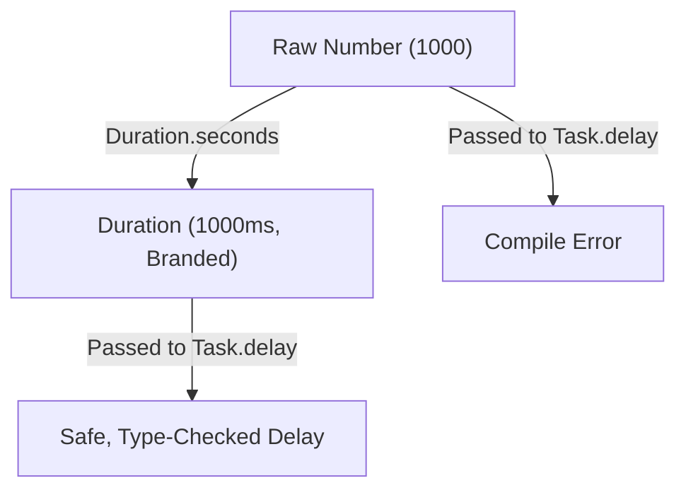

Time is one of the most common dimensions modeled in software systems. We constantly configure
request timeouts, token expirations, cache lifetimes, and execution delays.

In standard JavaScript and TypeScript, time is almost universally modeled as a raw `number`
representing milliseconds. However, a generic `number` carries no explicit unit information at the
type level. It is incredibly easy to pass a value in seconds to an API that expects milliseconds,
causing timers to fire a thousand times too fast, or connecting clients to time out instantly.

Because both values are structurally just `number`, TypeScript cannot flag these unit-mismatch
errors. The error only surfaces at runtime — often under specific, intermittent network conditions.

`Duration` solves this problem by wrapping time quantities in a compile-time type brand. This makes
the intended unit explicit, provides safe mathematical conversions, and prevents raw, un-branded
numbers from being passed to time-sensitive operations.

## The problem with primitive numbers for time

Consider a typical background worker that retries failed requests with a customizable timeout and
delay:

```ts
// What unit is expected here? Seconds? Milliseconds?
function configureTimeout(timeout: number, retryDelay: number) {
  // ...
}

const defaultTimeout = 30; // Seconds?
const defaultRetry = 500;  // Milliseconds?

configureTimeout(defaultTimeout, defaultRetry);
```

Nothing prevents a developer from swapping these arguments or passing the wrong scale. The compiler
happily accepts `configureTimeout(30, 500)`, even if the function internally treats both arguments
as milliseconds (making the timeout a practically instant 30 milliseconds).

To fix this defensively, developers often append unit suffixes to variable names (e.g.,
`timeoutMs`), but this is a convention that relies entirely on human memory and is easily bypassed.

## The shift to branded time quantities

`Duration` changes this by raising time from a generic primitive to a distinct, branded type. At
runtime, a `Duration` is represented purely as a standard number of milliseconds, carrying **zero
runtime overhead**.

At compile time, however, the nominal type brand prevents it from being mixed with generic numbers
or other units.



## Creating Durations

We construct a `Duration` by calling the constructor that matches our mental model of the time
quantity. The internal representation is normalized to milliseconds automatically:

```ts
import { Duration } from "@nlozgachev/pipelined/types";

const halfSecond  = Duration.milliseconds(500);
const threeSeconds = Duration.seconds(3);
const tenMinutes   = Duration.minutes(10);
const twelveHours  = Duration.hours(12);
const oneDay       = Duration.days(1);
```

Once branded, TypeScript will reject any attempt to pass a raw number where a `Duration` is
expected:

```ts
declare function sleep(duration: Duration): Promise<void>;

// @ts-expect-error: Argument of type 'number' is not assignable to parameter of type 'Duration'
sleep(1000);

// Correct usage:
sleep(Duration.seconds(1));
```

## Converting Durations back to primitives

When interfacing with third-party libraries, native browser APIs, or database drivers that require
plain numbers, we unwrap the `Duration` into the specific unit we need:

```ts
const duration = Duration.minutes(1.5);

Duration.toMilliseconds(duration); // 90000
Duration.toSeconds(duration);      // 90
Duration.toMinutes(duration);      // 1.5
Duration.toHours(duration);        // 0.025
```

## Curried time arithmetic

We can perform arithmetic on durations. `Duration.add` and `Duration.subtract` are curried,
data-last operations that allow us to adjust time quantities cleanly inside a `pipe`:

```ts
import { pipe } from "@nlozgachev/pipelined/composition";

const requestTimeout = Duration.seconds(30);
const networkLatency = Duration.milliseconds(200);

// Add network latency and subtract a safety margin
const adjustedTimeout = pipe(
  requestTimeout,
  Duration.add(networkLatency),
  Duration.subtract(Duration.seconds(5))
);

Duration.toSeconds(adjustedTimeout); // 25.2
```

## Deep integration with asynchronous APIs

Within the `pipelined` ecosystem, all core time-sensitive operations strictly require `Duration`
types rather than raw numbers. This guarantees that delays, repeating poll tasks, and timeouts are
safe by default:

```ts
import { Task } from "@nlozgachev/pipelined/core";

// 1. Delaying execution
const delayedTask = pipe(
  Task.resolve("data"),
  Task.delay(Duration.seconds(2))
);

// 2. Setting a computation timeout
const guardedTask = pipe(
  fetchLargeDataset,
  Task.timeout(Duration.seconds(10), () => "timeout_error")
);

// 3. Scheduling a recurring poll
const pollingTask = pipe(
  checkQueueStatus,
  Task.repeat({ times: 5, delay: Duration.milliseconds(500) })
);
```

## When to use Duration

### Use Duration when

- You are writing or configuring time-based logic — such as debounces, throttling, retry backoffs,
  connection timeouts, or cache TTL policies.
- You want to eliminate ambiguous time parameters (e.g. `timeout: number`) from your internal APIs
  and prevent caller-side unit errors.
- You are using core `pipelined` time utilities like `Task.delay`, `Task.timeout`, or `Op`
  schedules, which enforce `Duration` at the compiler level.

### Use raw numbers when

- You are writing low-level utility functions that interface directly with raw, un-branded system
  timestamps (such as `Date.now()`).
- You are optimizing performance-critical rendering frames or real-time simulation loops where the
  instantiation of intermediate branded types would introduce garbage collection overhead.
