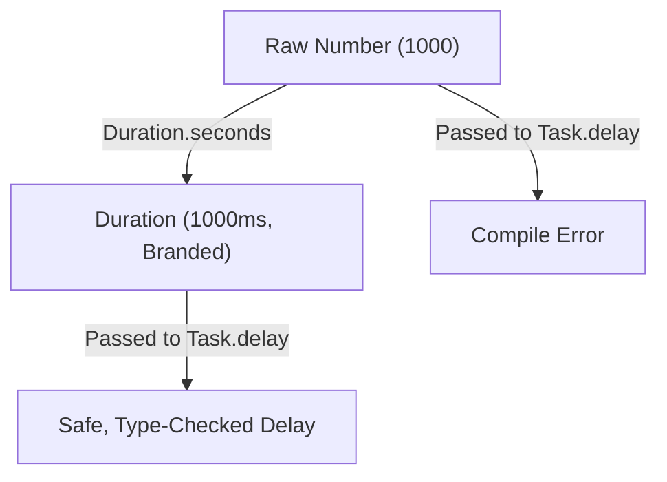

Modeling time quantities as raw `number` primitives introduces silent unit-mismatch bugs (such as
passing seconds to a function expecting milliseconds). Because both values are typed as `number`,
TypeScript cannot catch the error at compile time.

`Duration` provides a branded, unit-safe representation of time with explicit constructors
(`Duration.seconds`, `Duration.millis`) and conversion helpers.

## The problem with primitive numbers for time

Consider a typical background worker that retries failed requests with a customizable timeout and
delay:

```ts
// What unit is expected here? Seconds? Milliseconds?
function configureTimeout(timeout: number, retryDelay: number) {
  // ...
}

const defaultTimeout = 30; // Seconds?
const defaultRetry = 500;  // Milliseconds?

configureTimeout(defaultTimeout, defaultRetry);
```

Nothing prevents a developer from swapping these arguments or passing the wrong scale. The compiler
happily accepts `configureTimeout(30, 500)`, even if the function internally treats both arguments
as milliseconds (making the timeout a practically instant 30 milliseconds).

To fix this defensively, developers often append unit suffixes to variable names (e.g.,
`timeoutMs`), but this is a convention that relies entirely on human memory and is easily bypassed.

## The shift to branded time quantities

`Duration` changes this by raising time from a generic primitive to a distinct, branded type. At
runtime, a `Duration` is represented purely as a standard number of milliseconds, carrying **zero
runtime overhead**.

At compile time, however, the nominal type brand prevents it from being mixed with generic numbers
or other units.


```mermaid
flowchart TD
    A["Raw Number (1000)"] -- "Duration.seconds" --> B["Duration (1000ms, Branded)"]
    B -- "Passed to Task.delay" --> C["Safe, Type-Checked Delay"]
    A -- "Passed to Task.delay" --> D["Compile Error"]
```

## Creating Durations

We construct a `Duration` by calling the constructor that matches our mental model of the time
quantity. The internal representation is normalized to milliseconds automatically:

```ts
import { Duration } from "@nlozgachev/pipelined/types";

const halfSecond  = Duration.milliseconds(500);
const threeSeconds = Duration.seconds(3);
const tenMinutes   = Duration.minutes(10);
const twelveHours  = Duration.hours(12);
const oneDay       = Duration.days(1);
```

Once branded, TypeScript will reject any attempt to pass a raw number where a `Duration` is
expected:

```ts
declare function sleep(duration: Duration): Promise<void>;

// @ts-expect-error: Argument of type 'number' is not assignable to parameter of type 'Duration'
sleep(1000);

// Correct usage:
sleep(Duration.seconds(1));
```

## Converting Durations back to primitives

When interfacing with third-party libraries, native browser APIs, or database drivers that require
plain numbers, we unwrap the `Duration` into the specific unit we need:

```ts
const duration = Duration.minutes(1.5);

Duration.to.milliseconds(duration); // 90000
Duration.to.seconds(duration);      // 90
Duration.to.minutes(duration);      // 1.5
Duration.to.hours(duration);        // 0.025
```

## Curried time arithmetic

We can perform arithmetic on durations. `Duration.add` and `Duration.subtract` are curried,
data-last operations that allow us to adjust time quantities cleanly inside a `pipe`:

```ts
import { pipe } from "@nlozgachev/pipelined/composition";

const requestTimeout = Duration.seconds(30);
const networkLatency = Duration.milliseconds(200);

// Add network latency and subtract a safety margin
const adjustedTimeout = pipe(
  requestTimeout,
  Duration.add(networkLatency),
  Duration.subtract(Duration.seconds(5))
);

Duration.to.seconds(adjustedTimeout); // 25.2
```

## Deep integration with asynchronous APIs

Within the `pipelined` ecosystem, all core time-sensitive operations strictly require `Duration`
types rather than raw numbers. This guarantees that delays, repeating poll tasks, and timeouts are
safe by default:

```ts
import { Task } from "@nlozgachev/pipelined/core";

// 1. Delaying execution
const delayedTask = pipe(
  Task.resolve("data"),
  Task.delay(Duration.seconds(2))
);

// 2. Setting a computation timeout
const guardedTask = pipe(
  fetchLargeDataset,
  Task.timeout({ duration: Duration.seconds(10), onTimeout: () => "timeout_error" })
);

// 3. Scheduling a recurring poll
const pollingTask = pipe(
  checkQueueStatus,
  Task.repeat({ times: 5, delay: Duration.milliseconds(500) })
);
```

## Problems it solves

- **Eliminating time unit ambiguity in configurations**: When configuring HTTP timeouts, debounce
  intervals, cache TTLs, or retry backoffs, accepting raw numbers forces developers to guess whether
  the function expects seconds or milliseconds. Passing `5` instead of `5000` leads to premature
  timeout failures in production. `Duration` makes time units explicit (`Duration.seconds(5)`,
  `Duration.minutes(10)`).
- **Safe duration arithmetic and rate-limit comparisons**: Calculating total timeout budgets, adding
  exponential backoff delays with jitter, or comparing elapsed spans using raw numbers risks mixing
  millisecond and second units. `Duration` provides unit-safe arithmetic (`Duration.add`,
  `Duration.times`) and comparisons.
- **Cache TTL and session expiry policies**: Calculating cache eviction deadlines or token validity
  spans in security middlewares without manual millisecond multiplier math (`Duration.hours(2)`).
- **Unified time modeling across async utilities**: Core asynchronous combinators (such as
  `Task.timeout`, `Task.delay`, and `Op` repeat schedules) enforce `Duration` at the type level,
  establishing a single consistent time model across the entire application.
