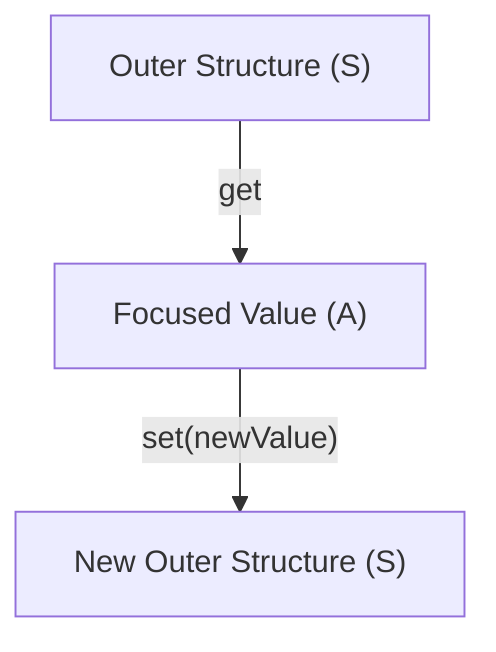

Managing nested state is one of the most common sources of complexity in frontend and backend
applications. When our data structures grow beyond simple flat objects, updating a single deeply
nested field becomes surprisingly difficult to do safely and cleanly.

In standard JavaScript, we are faced with a frustrating choice: mutate the data structure in place
and risk unpredictable side effects, or write verbose, fragile chains of nested object spreads to
perform an immutable update.

`Lens` offers a elegant alternative by treating the path to a nested field as a first-class,
reusable value. A lens acts as a telescope focused on a specific part of a larger structure,
allowing us to read, overwrite, or modify that part immutably without manually traversing the
nesting every time.

## The problem with deep nesting and mutation

Consider an application configuration that manages database connections and connection pools:

```ts
type AppConfig = {
  env: string;
  database: {
    host: string;
    port: number;
    pool: {
      min: number;
      max: number;
    };
  };
};

const config: AppConfig = {
  env: "production",
  database: {
    host: "db.local",
    port: 5432,
    pool: {
      min: 2,
      max: 10,
    },
  },
};
```

If we need to adjust the maximum pool size, the most direct approach is mutation:

```ts
config.database.pool.max = 20;
```

While simple, this mutation modifies the object in place. If another part of our application holds a
reference to `config`, or if a state management system (such as React) relies on reference changes
to trigger updates, this silent modification bypasses those mechanisms. It also makes tracking down
when and where a value changed exceptionally difficult, as the change leaves no trace in the call
stack.

To update the configuration immutably using native JavaScript, we must copy every level of nesting:

```ts
const updatedConfig = {
  ...config,
  database: {
    ...config.database,
    pool: {
      ...config.database.pool,
      max: 20,
    },
  },
};
```

This spread pattern is syntactically heavy, error-prone, and tightly coupled to the exact shape of
our data. If we rename `database` or add another layer, we have to rewrite every spread chain
throughout our codebase.

## The shift to first-class paths

A `Lens<S, A>` separates the description of *where* a value lives from *what* we do with it. A lens
is defined by two pure functions:

- A getter to extract the focused value `A` from the outer structure `S`.
- A setter to return a new outer structure `S` with the focused value `A` replaced.



By defining this path once as a standalone variable, we can reuse it to read, write, and modify the
target field across our application.

## Creating lenses

The simplest way to create a lens is with `Lens.prop`, which focuses on a single property of an
object. The double-parenthesis syntax (`prop<Source>()("key")`) allows TypeScript to autocomplete
keys and enforce type safety:

```ts
import { Lens } from "@nlozgachev/pipelined/core";

// Focus on the database property of AppConfig
const databaseLens = Lens.prop<AppConfig>()("database");

// Focus on the pool property of DatabaseConfig
type DatabaseConfig = AppConfig["database"];
const poolLens = Lens.prop<DatabaseConfig>()("pool");
```

For custom paths — such as navigating a non-standard data structure or mapping values on the fly —
we can define a lens manually using `Lens.make`:

```ts
const coordinatesLens = Lens.make(
  (point: [number, number]) => point[0], // Getter: focus on the X coordinate
  (x) => (point) => [x, point[1]]        // Setter: return a new coordinate tuple
);
```

## Reading and writing deep values

Once we have a lens, we can use `Lens.get`, `Lens.set`, and `Lens.modify` to interact with our
structure. These operations are curried and accept the data structure as their last argument, making
them perfectly suited for `pipe`:

```ts
import { pipe } from "@nlozgachev/pipelined/composition";

const maxLens = Lens.prop<AppConfig["database"]["pool"]>()("max");

// 1. Reading a value
const currentMax = pipe(config.database.pool, Lens.get(maxLens)); // 10

// 2. Overwriting a value immutably
const newPool = pipe(config.database.pool, Lens.set(maxLens)(20));
// Returns a new pool object with max: 20

// 3. Modifying a value with a function
const doublePool = pipe(config.database.pool, Lens.modify(maxLens)(m => m * 2));
// Returns a new pool object with max: 20
```

## Composing paths for deep updates

Lenses are truly powerful because they compose. We can combine multiple shallow lenses into a single
deep lens using `Lens.andThen`.

This composition lets us build complex paths out of simple, reusable building blocks:

```ts
// Define the shallow lenses
const database = Lens.prop<AppConfig>()("database");
const pool = Lens.prop<AppConfig["database"]>()("pool");
const max = Lens.prop<AppConfig["database"]["pool"]>()("max");

// Compose them into a single deep lens
const maxConnectionsLens = pipe(
  database,
  Lens.andThen(pool),
  Lens.andThen(max)
);

// Read the deeply nested value
const currentMax = pipe(config, Lens.get(maxConnectionsLens)); // 10

// Update the deeply nested value immutably with one call
const nextConfig = pipe(
  config,
  Lens.set(maxConnectionsLens)(50)
);
```

Notice that the original `config` object remains completely unchanged. `nextConfig` is a new object
where only the database, pool, and max property references have been updated — all other properties
(like `env` or `database.host`) are shared by reference, ensuring excellent memory efficiency.

## Reaching fields that might be absent

A standard `Lens` assumes that the path is guaranteed to exist. If a property in our path is
optional (e.g. `host?: string`) or we want to focus on an element of an array that might be empty,
we must transition from a `Lens` to an `Optional`.

We can compose a `Lens` with an `Optional` path using `Lens.andThenOptional` or convert a lens
entirely with `Lens.toOptional`:

```ts
import { Optional } from "@nlozgachev/pipelined/core";

type UserProfile = {
  name: string;
  preferences?: {
    theme?: string;
  };
};

const profileLens = Lens.prop<UserProfile>()("name");
const preferencesOptional = Optional.prop<UserProfile>()("preferences");

// Transition from guaranteed path (Lens) to optional path (Optional)
const themeOptional = pipe(
  Lens.prop<UserProfile>()("preferences"),
  Lens.toOptional,
  Optional.andThen(Optional.prop<{ theme?: string }>()("theme"))
);
```

See the [Optional guide](/guides/optional) for details on navigating optional paths.

## When to use Lens vs Standard JavaScript

### Use Lens when

- You work with deeply nested data structures that must be updated immutably (e.g., in React state,
  Redux stores, or pure domain services).
- You want to reuse specific data paths across different parts of your application (such as reading
  and writing to the same config path in validation, parsing, and UI forms).
- You want to eliminate boilerplate spread syntax (`...`) and make deep updates highly readable and
  refactor-safe.
- You want to compose complex paths dynamically out of smaller, well-tested path segments.

### Use Standard JavaScript when

- Your data structures are completely flat or only one level deep; plain object spreads
  (`{ ...obj, key: value }`) are simple and carry no extra abstraction overhead.
- You are working in a performance-critical loop where the allocation of intermediate functions and
  setter closures would introduce unwanted CPU or garbage collection overhead.
- You are working in an codebase where mutation is the accepted paradigm and side effects are
  managed through other boundaries.
