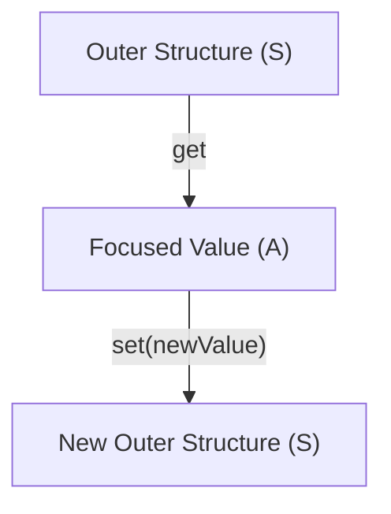

Updating deeply nested properties immutably in standard TypeScript requires nested object spread
syntax (`{ ...a, b: { ...a.b, c: ... } }`), which becomes verbose and error-prone.

`Lens<S, A>` models a bidirectional path to a required property `A` inside a parent structure `S`,
enabling immutable reads, writes, and modifications with a single reusable optic.

## The problem with deep nesting and object spreads

Consider an application configuration that manages database connections and connection pools:

```ts
type AppConfig = {
  env: string;
  database: {
    host: string;
    port: number;
    pool: {
      min: number;
      max: number;
    };
  };
};

const config: AppConfig = {
  env: "production",
  database: {
    host: "db.local",
    port: 5432,
    pool: {
      min: 2,
      max: 10,
    },
  },
};
```

If we need to adjust the maximum pool size, the most direct approach is mutation:

```ts
config.database.pool.max = 20;
```

While simple, this mutation modifies the object in place. If another part of our application holds a
reference to `config`, or if a state management system (such as React) relies on reference changes
to trigger updates, this silent modification bypasses those mechanisms. It also makes tracking down
when and where a value changed exceptionally difficult, as the change leaves no trace in the call
stack.

To update the configuration immutably using native JavaScript, we must copy every level of nesting:

```ts
const updatedConfig = {
  ...config,
  database: {
    ...config.database,
    pool: {
      ...config.database.pool,
      max: 20,
    },
  },
};
```

This spread pattern is syntactically heavy, error-prone, and tightly coupled to the exact shape of
our data. If we rename `database` or add another layer, we have to rewrite every spread chain
throughout our codebase.

## The shift to first-class paths

A `Lens<S, A>` separates the description of *where* a value lives from *what* we do with it. A lens
is defined by two pure functions:

- A getter to extract the focused value `A` from the outer structure `S`.
- A setter to return a new outer structure `S` with the focused value `A` replaced.


```mermaid
flowchart TD
    S["Outer Structure (S)"] -- "get" --> A["Focused Value (A)"]
    A -- "set(newValue)" --> S2["New Outer Structure (S)"]
```

By defining this path once as a standalone variable, we can reuse it to read, write, and modify the
target field across our application.

## Creating lenses

The simplest way to create a lens is with `Lens.from.property`, which focuses on a single property
of an object. The double-parenthesis syntax (`prop<Source>()("key")`) allows TypeScript to
autocomplete keys and enforce type safety:

```ts
import { Lens } from "@nlozgachev/pipelined/core";

// Focus on the database property of AppConfig
const databaseLens = Lens.from.property<AppConfig>()("database");

// Focus on the pool property of DatabaseConfig
type DatabaseConfig = AppConfig["database"];
const poolLens = Lens.from.property<DatabaseConfig>()("pool");
```

For custom paths — such as navigating a non-standard data structure or mapping values on the fly —
we can define a lens manually using `Lens.from.accessors`:

```ts
const coordinatesLens = Lens.from.accessors(
  (point: [number, number]) => point[0], // Getter: focus on the X coordinate
  (x) => (point) => [x, point[1]]        // Setter: return a new coordinate tuple
);
```

## Reading and writing deep values

Once we have a lens, we can use `Lens.get`, `Lens.set`, and `Lens.modify` to interact with our
structure. These operations are curried and accept the data structure as their last argument, making
them perfectly suited for `pipe`:

```ts
import { pipe } from "@nlozgachev/pipelined/composition";

const maxLens = Lens.from.property<AppConfig["database"]["pool"]>()("max");

// 1. Reading a value
const currentMax = pipe(config.database.pool, Lens.get(maxLens)); // 10

// 2. Overwriting a value immutably
const newPool = pipe(config.database.pool, Lens.set(maxLens)(20));
// Returns a new pool object with max: 20

// 3. Modifying a value with a function
const doublePool = pipe(config.database.pool, Lens.modify(maxLens)(m => m * 2));
// Returns a new pool object with max: 20
```

## Composing paths for deep updates

Lenses are truly powerful because they compose. We can combine multiple shallow lenses into a single
deep lens using `Lens.andThen`.

This composition lets us build complex paths out of simple, reusable building blocks:

```ts
// Define the shallow lenses
const database = Lens.from.property<AppConfig>()("database");
const pool = Lens.from.property<AppConfig["database"]>()("pool");
const max = Lens.from.property<AppConfig["database"]["pool"]>()("max");

// Compose them into a single deep lens
const maxConnectionsLens = pipe(
  database,
  Lens.andThen(pool),
  Lens.andThen(max)
);

// Read the deeply nested value
const currentMax = pipe(config, Lens.get(maxConnectionsLens)); // 10

// Update the deeply nested value immutably with one call
const nextConfig = pipe(
  config,
  Lens.set(maxConnectionsLens)(50)
);
```

The original `config` object remains unchanged. `nextConfig` is a new object where only the modified
path references have been updated; unchanged subtrees are preserved by reference.

## Reaching fields that might be absent

A standard `Lens` assumes that the path is guaranteed to exist. If a property in our path is
optional (e.g. `host?: string`) or we want to focus on an element of an array that might be empty,
we must transition from a `Lens` to an `Optional`.

We can compose a `Lens` with an `Optional` path using `Lens.andThenOptional` or convert a lens
entirely with `Lens.toOptional`:

```ts
import { Optional } from "@nlozgachev/pipelined/core";

type UserProfile = {
  name: string;
  preferences?: {
    theme?: string;
  };
};

const profileLens = Lens.from.property<UserProfile>()("name");
const preferencesOptional = Optional.from.property<UserProfile>()("preferences");

// Transition from guaranteed path (Lens) to optional path (Optional)
const themeOptional = pipe(
  Lens.from.property<UserProfile>()("preferences"),
  Lens.toOptional,
  Optional.andThen(Optional.from.property<{ theme?: string }>()("theme"))
);
```

See the [Optional guide](/guides/optional) for details on navigating optional paths.

## Problems it solves

- **Deep immutable updates without spread boilerplate**: In React, Redux, or Zustand state trees,
  modifying nested properties three or four levels deep requires multiple levels of spread operators
  (`{ ...state, user: { ...state.user, settings: { ... } } }`). `Lens` encapsulates bidirectional
  get/set operations, enabling single-line immutable updates at any depth.
- **Decoupling child UI components with sub-model focusing**: Passing an entire global state tree to
  a child form component couples it to the root schema. Passing a focused `Lens<State, Address>`
  allows the child component to read and update only its specific sub-model while remaining
  completely agnostic of the parent container structure.
- **Atomic property modifications (`Lens.modify`)**: Applying pure transformation functions directly
  to nested fields (such as incrementing counters, trimming strings, or appending items to nested
  lists) via `Lens.modify` without extracting the value first.
- **Reusable bidirectional property bindings in forms**: In form controllers and settings editors,
  field components need to both read nested values for rendering and immutably write back user
  inputs on change. `Lens` turns nested data paths into first-class values that can be passed
  directly to form inputs, validation routines, and persistence layers.
- **Composable data path navigation**: Individual lenses targeting sub-models can be combined using
  `Lens.andThen`, allowing complex domain access paths to be assembled dynamically from small,
  modular path definitions.
