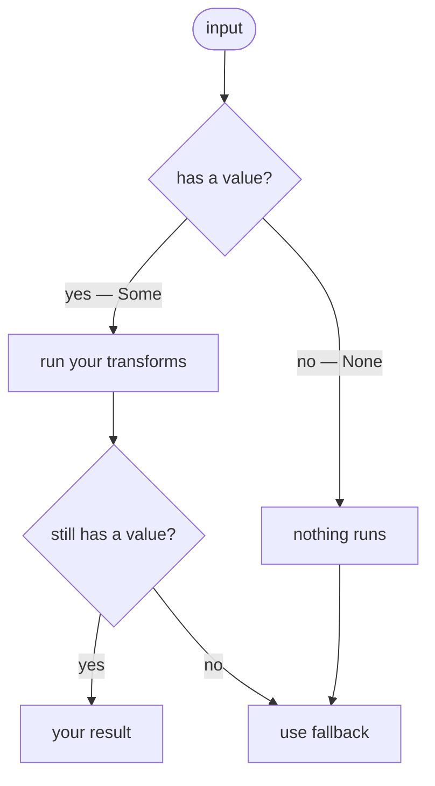
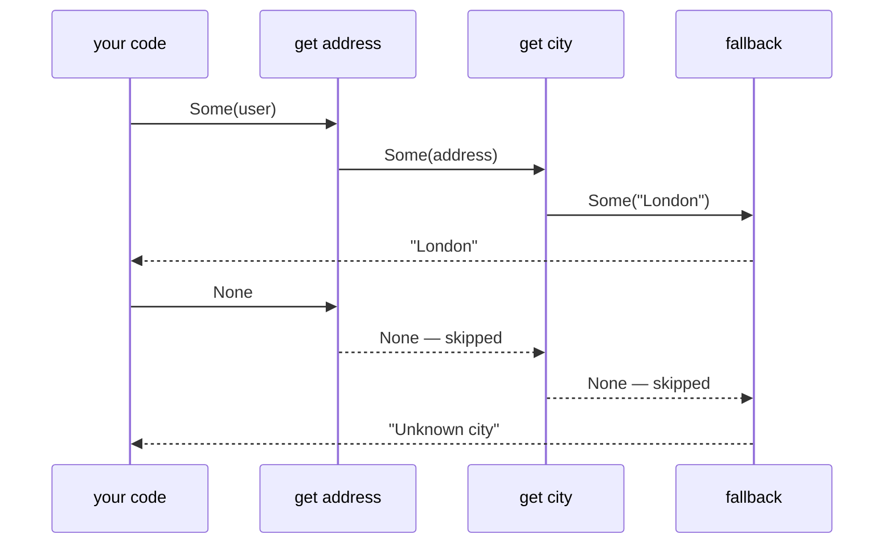

Absence is everywhere in real code. A user that might not be in the database, a config value that
might not be set, a lookup that might come up empty. The usual answer is `T | null`, and then a null
check at every call site — each one a reminder that something might not be there. `Maybe<A>` makes
the absence part of the type itself, so the check happens once and composes cleanly with everything
else.



## The problem with null

When a function returns `User | null`, nothing in the type system stops you from accessing `.name`
without checking first. The compiler will warn you in strict mode, but the check lives in your code
— and your code alone. Every caller has to remember to do it:

```ts
const user = getUser(id);
const name = user ? user.name : "Unknown"; // remember at every call site
```

This scales poorly. The more values that might be absent, the more `if (x !== null)` checks you
accumulate, often spread across different files and functions.

## The Maybe approach

With `Maybe`, the absence is encoded in the type itself. You can't accidentally skip the check —
the operations that work on an `Maybe` handle both cases for you:

```ts
import { pipe } from "@nlozgachev/pipelined/composition";
import { Maybe } from "@nlozgachev/pipelined/core";

declare function getUser(id: string): Maybe<User>;

const name = pipe(
	getUser(id),
	Maybe.map((user) => user.name), // only runs if user exists
	Maybe.getOrElse(() => "Unknown"), // provides the fallback
);
```

The `map` step only executes if the value is `Some`. If `getUser` returns `None`, the `map` is
skipped and `None` flows through to `getOrElse`, which then returns the fallback. You never wrote a
conditional — the type enforced the handling.

## Creating Maybe

```ts
Maybe.some(42); // Some(42) — wrap a value
Maybe.none(); // None     — explicit absence
Maybe.fromNullable(value); // Some if non-null, None if null or undefined
Maybe.fromUndefined(value); // Some if defined, None if undefined
```

`fromNullable` is the most common entry point when working with existing APIs that return `null` or
`undefined`:

```ts
const setting = pipe(
	config.get("theme"), // string | undefined
	Maybe.fromNullable, // Maybe<string>
	Maybe.getOrElse(() => "light"), // string
);
```

## Transforming values with `map`

`map` transforms the value inside a `Some`, leaving `None` untouched:

```ts
pipe(
	Maybe.some(5),
	Maybe.map((n) => n * 2),
); // Some(10)
pipe(
	Maybe.none(),
	Maybe.map((n) => n * 2),
); // None
```

You can chain multiple `map` calls — each one only runs if the previous step produced a `Some`:

```ts
pipe(
	Maybe.fromNullable(user),
	Maybe.map((u) => u.address),
	Maybe.map((a) => a.city),
	Maybe.getOrElse(() => "Unknown city"),
);
```

## Chaining with `chain`

When a transformation itself might produce an absent value, use `chain` instead of `map`. It
prevents nesting `Maybe<Maybe<A>>`:

```ts
const parseNumber = (s: string): Maybe<number> => {
	const n = parseInt(s, 10);
	return isNaN(n) ? Maybe.none() : Maybe.some(n);
};

pipe(Maybe.some("42"), Maybe.chain(parseNumber)); // Some(42)
pipe(Maybe.some("abc"), Maybe.chain(parseNumber)); // None
pipe(Maybe.none(), Maybe.chain(parseNumber)); // None
```

Think of it as: `map` is for transformations that always succeed; `chain` is for transformations
that might not.

## Filtering

`filter` turns a `Some` into `None` if the value doesn't satisfy a predicate:

```ts
pipe(
	Maybe.some(5),
	Maybe.filter((n) => n > 3),
); // Some(5)
pipe(
	Maybe.some(2),
	Maybe.filter((n) => n > 3),
); // None
```

This is useful for narrowing values within a pipeline without breaking out of the `Maybe` context.

If you find yourself calling `toNullable` early to continue processing, that's usually a signal to
use `map` or `chain` instead — breaking out of `Maybe` too early means writing null checks again
downstream.

## Extracting the value

At the edge of your pipeline, you need to get a plain value back. There are a few ways:

**`getOrElse`** — provide a fallback as a thunk `() => B`. The thunk is only called when the
Maybe is `None`, so expensive or side-effectful defaults are never computed unnecessarily. The
fallback can be a different type, widening the result to the union of both:

```ts
pipe(Maybe.some(5), Maybe.getOrElse(() => 0)); // 5
pipe(Maybe.none(), Maybe.getOrElse(() => 0)); // 0
pipe(Maybe.none(), Maybe.getOrElse(() => null)); // null — typed as number | null
```

**`match`** — handle each case explicitly, producing a value from either branch. `fold` is the
positional form — none handler first, some handler second — if you'd rather not name the cases:

```ts
pipe(
	possiblyUser,
	Maybe.match({
		some: (user) => `Welcome, ${user.name}`,
		none: () => "Please log in",
	}),
);
```

For interop with APIs that expect `null` or `undefined`, `toNullable` and `toUndefined` convert
back at the boundary.

## Recovering from None

`recover` provides a fallback `Maybe` when the current one is `None`. Unlike `getOrElse`, the
fallback is itself an `Maybe` — useful when the fallback operation might also fail. The fallback
can produce a different type, widening the result to `Maybe<A | B>`:

```ts
pipe(
	Maybe.fromNullable(cache.get(key)),
	Maybe.recover(() => Maybe.fromNullable(db.get(key))),
	Maybe.getOrElse(() => defaultValue),
);
```

## Converting to and from Result

`Maybe` and `Result` are closely related — the difference is whether the absent case carries an
error message. You can convert between them:

```ts
// Maybe → Result: provide an error for the None case
pipe(
	Maybe.fromNullable(user),
	Maybe.toResult(() => "User not found"),
); // Result<string, User>

// Result → Maybe: discard the error, keep only the success
Maybe.fromResult(Result.err("oops")); // None
Maybe.fromResult(Result.ok(42)); // Some(42)
```



## When to use Maybe vs null

Use `Maybe` when:

- You want absence to be visible in the type signature and composable through pipelines
- Multiple operations in sequence might each fail to find a value
- You want to use `map`, `chain`, and `filter` without manual null checks at every step

Keep returning `null` or `undefined` when:

- You're writing a small utility that only you consume and null is simpler
- You're interfacing with code that expects null (use `toNullable` at the boundary)
