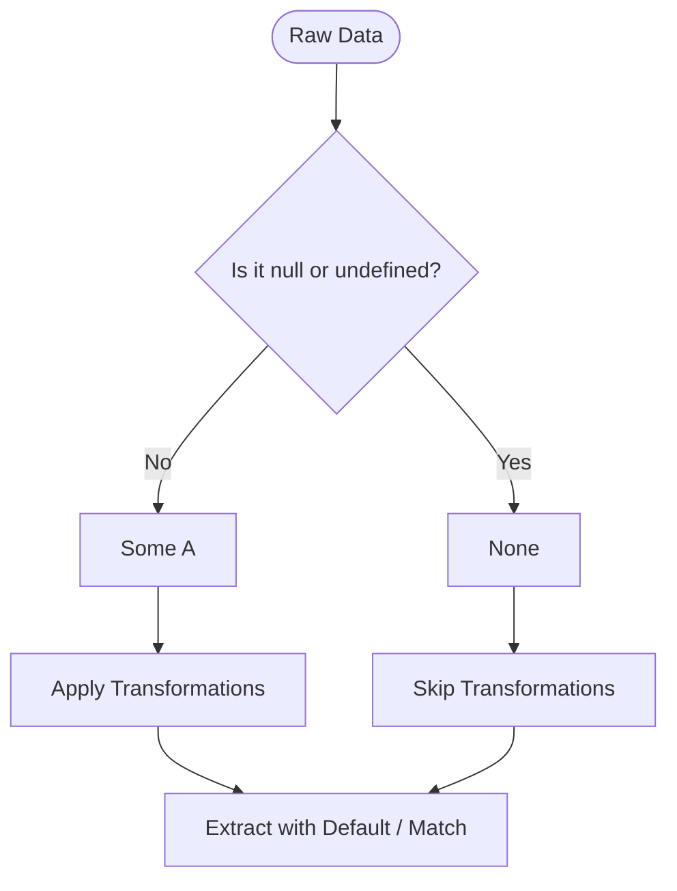

In modern software development, we spend a massive amount of time dealing with things that are not
there. We query a database for a record that might have been deleted; we look up a key in a
configuration file that might be missing; we search a list for an item that is not present.

In traditional TypeScript, we typically represent this nothingness with `null` or `undefined`. On
the surface, this approach seems simple. But as systems grow, we find that it introduces a subtle,
persistent friction: it intertwines the logic of *what* we want to do with a value and the defensive
checking of *whether* that value even exists.

## The problem with null

Consider a simple, everyday snippet of TypeScript:

```ts
const user = getUser(id);
const name = user ? user.name : "Unknown";
```

On the surface, this is familiar and easy to write. But notice the implicit coupling. The caller of
`getUser` cannot simply ask for the user's name; they must first stop, pivot their attention, and
inspect the pointer. If they forget, strict mode might warn them, but the responsibility of the
check still lives in the runtime flow of their code.

When we have a pipeline of operations — say, taking a configuration setting, parsing it into a
number, and then checking if it is within a valid range — this defensive checking must be repeated
at every step. The happy path of our logic and the recovery path of handling absence are twisted
together. They are complected.

```ts
const rawValue = config.get("timeout");
let timeout = 1000; // default

if (rawValue !== undefined && rawValue !== null) {
  const parsed = parseInt(rawValue, 10);
  if (!isNaN(parsed)) {
    if (parsed > 0) {
      timeout = parsed;
    }
  }
}
```

This code is hard to read not because the math is complicated, but because the business logic
(parsing and bounds validation) is constantly interrupted by guards against nothingness.

## The Maybe approach

What if we could separate these concerns? What if absence was not a missing pointer or a blank
space, but a first-class value in its own right? A value that carries its own rules for
transformation.

This is the purpose of `Maybe`. It is a data structure that represents a choice: either we have
something (`Some`), or we have nothing (`None`).



By representing absence as a data structure rather than a language keyword, we can write our
transformations as if the value is always there. The data structure itself manages the control flow.
We decouple the *what* from the *if*.

```ts
import { pipe } from "@nlozgachev/pipelined/composition";
import { Maybe } from "@nlozgachev/pipelined/core";

export type Maybe<A> = Some<A> | None;
```

---

## Creating Maybe

To work within this model, we must first lift our raw, potentially unsafe values into a `Maybe`
context. This is the boundary where the messy real world meets our clean system.

```ts
// Wrapping an existing value
const five = Maybe.some(5); // Maybe<number>

// Representing explicit absence
const empty = Maybe.none(); // Maybe<never>
```

In practice, you will rarely write `some` or `none` manually. Instead, you will ingest values coming
from external interfaces — such as third-party libraries, DOM elements, or API payloads — which use
`null` or `undefined`. For this, we use `fromNullable`:

```ts
interface AppConfig {
  theme?: "light" | "dark";
}

const config: AppConfig = {};

const theme = Maybe.fromNullable(config.theme); // None
```

---

## Transforming values

Once our data is wrapped inside a `Maybe`, we do not immediately unpack it. Instead, we describe how
the value should change if it is present.

### Pure transformations with `map`

If we have a `Some`, `map` applies a function to the value inside and returns a new `Some` with the
result. If we have a `None`, `map` does nothing and returns the `None` unchanged.

```ts
const double = (n: number) => n * 2;

pipe(Maybe.some(5), Maybe.map(double)); // Some(10)
pipe(Maybe.none(), Maybe.map(double));  // None
```

Consider how this simplifies deep record navigation. Imagine parsing a user profile to extract their
avatar's filename:

```ts
interface User {
  profile?: {
    avatarUrl?: string;
  };
}

const getAvatarFilename = (user: User): Maybe<string> =>
  pipe(
    Maybe.fromNullable(user.profile),
    Maybe.map((p) => p.avatarUrl),
    Maybe.map((url) => url.split("/").pop()),
  );
```

We do not write a single `if` statement. If `profile` is missing, the first `map` is skipped. If
`avatarUrl` is missing, the second `map` is skipped. The pipeline remains perfectly linear, and we
are guaranteed never to encounter a `TypeError: Cannot read properties of undefined`.

### Nested pipelines with `chain`

Sometimes, a transformation itself might return a `Maybe`. For example, we might want to take a
string and parse it into an integer. The parsing operation is fallible — if the string is `"abc"`,
there is no valid number to return.

If we were to use `map` with a function that returns a `Maybe`, we would end up with a nested type:
`Maybe<Maybe<number>>`. This is inconvenient to work with.

```ts
const parseInteger = (s: string): Maybe<number> => {
  const n = parseInt(s, 10);
  return isNaN(n) ? Maybe.none() : Maybe.some(n);
};

// Using map results in nesting:
const nested = pipe(Maybe.some("42"), Maybe.map(parseInteger)); // Some(Some(42))
```

To resolve this, we use `chain`. It applies the transformation and flattens the nested structure,
leaving us with a clean `Maybe<number>`.

```ts
const flat = pipe(Maybe.some("42"), Maybe.chain(parseInteger)); // Some(42)
const failed = pipe(Maybe.some("abc"), Maybe.chain(parseInteger)); // None
```

Think of `map` as a tool for transformations that are guaranteed to succeed once a value is present,
and `chain` as a tool for transformations that themselves introduce the possibility of failure.

### Narrowing focus with `filter` and `fromPredicate`

Sometimes a value exists, but it does not meet our business criteria. We can use `filter` to turn a
`Some` into a `None` if it fails to satisfy a predicate.

```ts
const isEven = (n: number) => n % 2 === 0;

pipe(Maybe.some(4), Maybe.filter(isEven)); // Some(4)
pipe(Maybe.some(5), Maybe.filter(isEven)); // None
```

If we are starting from a raw value rather than a `Maybe`, we can use `fromPredicate` to decide
whether to wrap the value in `Some` or `None` right at the boundary:

```ts
const validateAge = (age: number): Maybe<number> =>
  pipe(
    age,
    Maybe.fromPredicate((n) => n >= 18),
  );
```

---

## Extracting the value

Eventually, our pipeline must interface with the rest of our application — libraries that expect
standard TypeScript primitives, UI frameworks, or database connectors. We must step out of our
philosophical data structures and return a concrete value. We call this reaching the edge.

### Safe fallbacks with `getOrElse`

The most common exit point is `getOrElse`. It extracts the value from a `Some`, or returns a
fallback value if we have a `None`.

```ts
pipe(
  Maybe.some("admin"),
  Maybe.getOrElse(() => "guest"),
); // "admin"

pipe(
  Maybe.none(),
  Maybe.getOrElse(() => "guest"),
); // "guest"
```

Notice that `getOrElse` takes a function — a thunk — rather than a direct value. This is a
deliberate design choice. If computing the fallback is expensive or triggers a side effect (such as
writing to a log or generating a token), that computation is deferred. It is only executed if the
value is actually absent.

### Case analysis with `match` and `fold`

When you need to perform different logic for both the success and failure cases, you can use `match`
for a named object syntax, or `fold` for a positional, error-first syntax.

```ts
// Using match with named handlers
const welcomeMessage = pipe(
  maybeUser,
  Maybe.match({
    some: (user) => `Welcome back, ${user.name}`,
    none: () => "Please log in to continue",
  }),
);

// Using fold with positional arguments (none handler first)
const statusString = pipe(
  maybeUser,
  Maybe.fold(
    () => "Inactive",
    (user) => `Active since ${user.createdAt}`,
  ),
);
```

### Interoperability with standard TypeScript

If you are passing the result to an external library that expects standard `null` or `undefined`
values, you can convert the `Maybe` back at the very end of your pipeline:

```ts
const nullable = Maybe.toNullable(maybeValue);   // T | null
const undefinedVal = Maybe.toUndefined(maybeValue); // T | undefined
```

---

## Side effects with tap

Occasionally, you need to perform a side effect — such as writing a message to a log or updating a
metric — without altering the data or breaking the flow of your pipeline. For this, we use `tap`.

`tap` runs a side-effectful function on the value inside a `Some` and returns the original `Maybe`
unchanged. If the `Maybe` is `None`, the function is ignored.

```ts
pipe(
  Maybe.some("Configuration parsed successfully"),
  Maybe.tap((msg) => console.log(msg)),
  Maybe.map((msg) => msg.toUpperCase()),
); // Logs message, then continues to produce Some("CONFIGURATION PARSED SUCCESSFULLY")
```

---

## Recovering from None

When an operation fails to produce a value, we don't always want to settle for a static fallback.
Often, we want to try a secondary, fallible strategy. For instance, if a config is not in our memory
cache, we might want to look for it in the database.

For this, we use `recover`. It takes a function that returns another `Maybe` when the current one is
`None`.

```ts
const getTheme = (userId: string): Maybe<string> =>
  pipe(
    Maybe.fromNullable(cache.get(`theme:${userId}`)),
    Maybe.recover(() => Maybe.fromNullable(db.get(`theme:${userId}`))),
    Maybe.getOrElse(() => "light"),
  );
```

If the cache hit succeeds, the database lookup is never evaluated. If the cache misses, we attempt
the database lookup. Only if both fail do we settle for the fallback value `"light"`.

---

## Converting to and from Result

A `Maybe` represents absence but does not tell you *why* the value is missing. Sometimes, absence is
an error, and we need to attach a reason to it.

We can transition from a `Maybe` to a `Result` using `toResult`. We provide a thunk that generates
an error value if the `Maybe` is a `None`:

```ts
import { Result } from "@nlozgachev/pipelined/core";

const parseEmail = (email: string): Maybe<string> =>
  pipe(
    email,
    Maybe.fromPredicate((e) => e.includes("@")),
  );

const signup = (rawEmail: string) =>
  pipe(
    parseEmail(rawEmail),
    Maybe.toResult(() => "Email address must contain an '@' symbol"),
  ); // Result<string, string>
```

Conversely, if we have a `Result` and want to discard the error context, we can downgrade it to a
`Maybe` using `fromResult`:

```ts
const maybeValue = Maybe.fromResult(Result.err("An error occurred")); // None
```

---

## Composition in practice

Let us look at how these elements fit together into a cohesive, structured pipeline. We will take a
raw query parameter representing a page offset, validate it, apply pagination bounds, and return a
clean offset index.

```ts
const getPageOffset = (rawOffset: string | undefined, pageSize: number): number =>
  pipe(
    Maybe.fromNullable(rawOffset),                     // Maybe<string>
    Maybe.chain(parseInteger),                         // Maybe<number>
    Maybe.filter((offset) => offset >= 0),             // Maybe<number>
    Maybe.map((offset) => offset * pageSize),          // Maybe<number>
    Maybe.getOrElse(() => 0),                          // number
  );
```

Observe the flow. Every step is insulated. The parsing logic, the validation criteria, and the
mathematical mapping are written in a straight, readable line, fully detached from the defensive
logic of verifying the presence of `rawOffset`.

---

## When to use Maybe vs null

The introduction of `Maybe` into a codebase is a structural decision. It is not always the correct
choice for every line of code.

### Use Maybe when:

- **The pipeline is long**: You have multiple steps of transformations, filtering, and recovery that
  could each result in absence.
- **The type is public**: You want absence to be explicitly declared in your module signatures,
  forcing callers to acknowledge it.
- **You value composition**: You want to compose operations using `pipe` and clean, pure functions.

### Keep using null or undefined when:

- **The scope is local**: Inside a small, internal function where a simple ternary or `??` operator
  is easier to read and has zero performance overhead.
- **The boundary expects it**: When writing low-level wrappers directly interfacing with large
  third-party libraries (e.g., database drivers) that heavily rely on `null` returns. Convert to
  `Maybe` only once the data passes this boundary.
