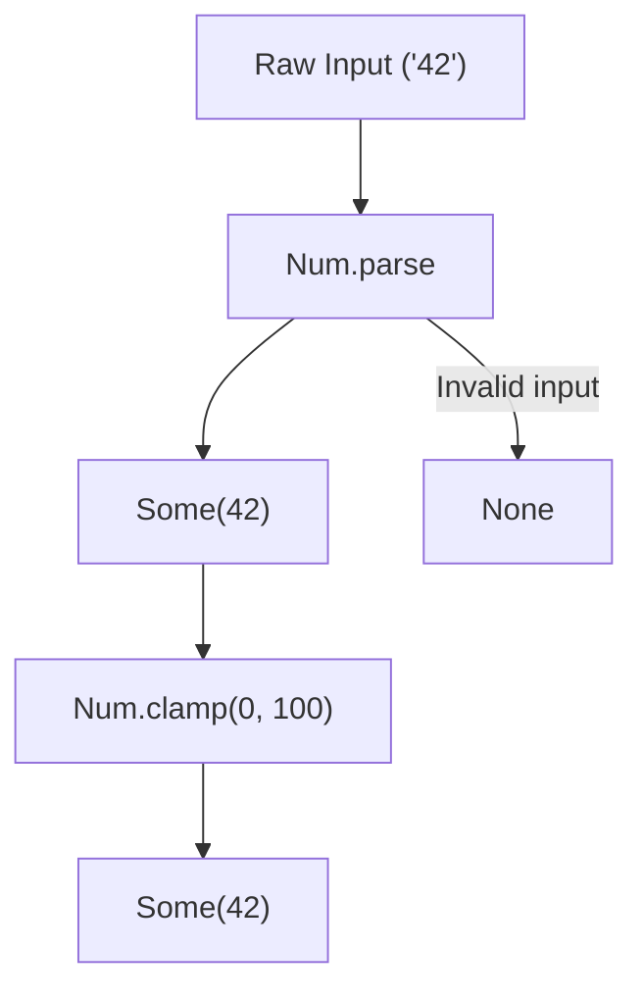

Working with numbers in standard JavaScript or TypeScript often leads to code cluttered with
anonymous arrow functions, manual `isNaN` checks, and verbose range-bounding conditionals.

Simple pipelines — such as transforming API response counts, filtering temperature readings, or
calculating averages from form inputs — frequently require us to write repetitive expressions like
`n => n * 100`, `Math.max(0, Math.min(100, value))`, or checking if a parsed number is actually a
number.

`Num` replaces these imperative checks and inline math formulas with declarative, curried,
pipeline-ready operations. By modeling arithmetic and validation as first-class functions, we can
compose clear, self-describing transformations without scattering temporary arrow functions
throughout our codebase.

## The problem with scattered arithmetic and NaN

Consider a backend service that processes incoming query parameters representing user-configurable
slider values:

```ts
function parseSliderValue(rawInput: string | undefined): number {
  if (rawInput === undefined) {
    return 50; // Default fallback
  }

  const parsed = parseFloat(rawInput);
  if (isNaN(parsed)) {
    return 50;
  }

  // Clamp the value between 0 and 100
  return Math.max(0, Math.min(100, parsed));
}
```

This code works, but it entangles parsing, validation, clamping, and fallback logic within a single
imperative block. If we want to map this over an array of inputs, we must write a wrapping helper
function or embed inline ternary checks.

Additionally, standard JavaScript arithmetic contains structural pitfalls: dividing by zero does not
fail at the type level or throw an exception — it returns `Infinity`, which silently propagates
through our application, causing unpredictable mathematical errors downstream.

## The shift to declarative arithmetic

`Num` treats mathematical operations and conversions as pure, composable steps. It introduces safety
at the type level: operations that can fail (such as parsing an invalid string or dividing by zero)
return a `Maybe` context, forcing us to handle the failure path explicitly.



## Safe numeric parsing

To convert a string into a number without encountering the `NaN` trap, we use `Num.parse`. It
returns a `Maybe<number>` context which explicitly models potential parsing failure:

```ts
import { Num } from "@nlozgachev/pipelined/utils";

Num.parse("42");    // Some(42)
Num.parse("3.14");  // Some(3.14)
Num.parse("abc");   // None
Num.parse("");      // None
```

## Curried arithmetic

Arithmetic functions in `Num` are curried and place the primary data argument last. This makes them
ideal for composition within `pipe` and `Arr.map`:

```ts
import { pipe } from "@nlozgachev/pipelined/composition";
import { Arr } from "@nlozgachev/pipelined/utils";

// Scale an array of scores
const baseScores = [10, 20, 30];
const scaled = pipe(
  baseScores,
  Arr.map(Num.multiply(1.5))
); // [15, 30, 45]

// Subtract a fee
const finalAmounts = pipe(
  [100, 200, 300],
  Arr.map(Num.subtract(10)) // equivalent to x => x - 10
); // [90, 190, 290]
```

To prevent runtime errors and silent `Infinity` propagation, division and remainder operations
return a `Maybe` context, returning `None` if the divisor is zero:

```ts
// Safe division
pipe(100, Num.divide(5)); // Some(20)
pipe(100, Num.divide(0)); // None

// Safe remainder
pipe(10, Num.remainder(3)); // Some(1)
pipe(10, Num.remainder(0)); // None
```

## Constraining and testing bounds

We can clamp a number to a specific range or test its membership using `Num.clamp` and
`Num.between`. Both boundaries are inclusive:

```ts
// Constrain a value to the range [0, 100]
pipe(150, Num.clamp(0, 100)); // 100
pipe(-5, Num.clamp(0, 100));  // 0
pipe(42, Num.clamp(0, 100));  // 42

// Test if a value falls within a range
const isWithinRange = pipe(25, Num.between(10, 50)); // true
```

## Generating sequences

To build sequences of numbers without manual `for` loops or pre-allocating arrays, we use
`Num.range`. It generates an array of numbers from `start` to `end` (both inclusive) with a
customizable step:

```ts
Num.range(0, 5);      // [0, 1, 2, 3, 4, 5]
Num.range(0, 10, 2);  // [0, 2, 4, 6, 8, 10]
Num.range(0, 9, 2);   // [0, 2, 4, 6, 8] (stops before exceeding the limit)
Num.range(5, 0);      // [] (when start > end, the range is empty)
```

## Statistical calculations on collections

Calculating statistics on arrays of numbers using standard JavaScript arrays can be unsafe. Calling
`Math.min` or `Math.max` on an empty array returns `Infinity` or `-Infinity`, and dividing a sum by
the length of an empty array returns `NaN`.

`Num` provides safe aggregate functions that model empty collections explicitly:

```ts
// Summing values (returns 0 for empty arrays)
Num.sum([10, 20, 30]); // 60
Num.sum([]);           // 0

// Calculating average (returns None for empty arrays, avoiding division by zero)
Num.mean([10, 20, 30]); // Some(20)
Num.mean([]);           // None

// Finding bounds safely
Num.min([5, 12, 3]); // Some(3)
Num.min([]);         // None

Num.max([5, 12, 3]); // Some(12)
Num.max([]);         // None
```

## Composing numeric pipelines

We can combine all of these utilities to build clean, self-contained data flows. Here, we parse raw
user inputs, filter out invalid numbers, clamp the valid ones, and calculate their average:

```ts
import { Maybe } from "@nlozgachev/pipelined/core";

const rawInputs = ["120", "invalid", "85", "40", "0"];

const averageValidScore = pipe(
  rawInputs,
  Arr.filterMap(Num.parse),          // [120, 85, 40, 0] (skips "invalid")
  Arr.map(Num.clamp(0, 100)),       // [100, 85, 40, 0] (clamps 120 to 100)
  Num.mean,                         // Some(56.25)
  Maybe.getOrElse(() => 0)          // 56.25 (defaults to 0 if no valid inputs)
);
```

## When to use Num vs standard operators

### Use Num when

- You are operating on numbers within a functional pipeline using `pipe` or array helpers like
  `Arr.map` and `Arr.filter`.
- You are parsing untrusted strings (e.g. query parameters, CSV fields, or form inputs) and want to
  avoid boilerplate `isNaN` or `NaN` checks.
- You need safe statistical calculations (`mean`, `min`, `max`) that gracefully handle empty
  collections without returning `Infinity` or `NaN`.
- You want to eliminate inline math boundaries and replace them with clear, readable predicates like
  `clamp` and `between`.

### Use standard operators when

- You are writing simple, isolated mathematical formulas (like `x * y + z`) inside a standard
  function body where currying and piping add unnecessary complexity.
- You are writing low-level, high-throughput numerical algorithms where the micro-overhead of
  allocating `Maybe` objects or curried function wrappers would impact performance.
