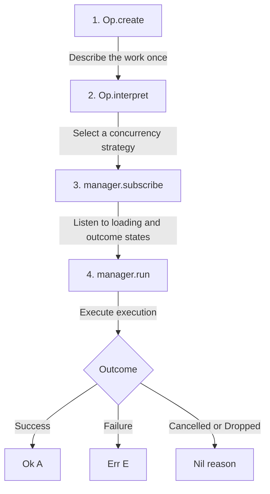

import { Aside } from '@astrojs/starlight/components'

Asynchronous coordination is one of the most persistent sources of accidental complexity in modern application development. 

Consider a standard search-as-you-type autocomplete input. A user types rapidly, firing three search queries in rapid succession. Because of internet latency, the first network request takes longer to resolve than the third. When the first request eventually lands last, it overwrites the newer search results with stale data. 

We know how to fix this: we must cancel the outstanding in-flight request whenever a new search is triggered. But implementing this usually complects our codebase. The cancellation logic—juggling `AbortController` instances, keeping track of active requests with `useRef` handles, and writing cleanup hooks—becomes tangled directly into our UI components and raw network calls.

`Op<I, E, A>` solves this by cleanly separating these concerns:

*   **What to do**: The core async work is defined once, in isolation, using `Op.create`.
*   **How to run it**: The concurrency, retry, and timeout strategies are configured later using `Op.interpret`.

By decoupling the *description* of the asynchronous work from its *execution strategy*, we write clean, testable logic and change how it runs without modifying a single line of business code.

---

## Creating an Op

To define our async task, we use `Op.create`. It takes an asynchronous factory function and an error mapper:

```ts
import { Op } from "@nlozgachev/pipelined/core";

interface User { id: string; name: string }
class ApiError extends Error { constructor(public reason: unknown) { super() } }

const fetchUser = Op.create(
  (signal) => (id: string) =>
    fetch(`/users/${id}`, { signal }).then((r) => {
      if (!r.ok) throw new Error(`HTTP ${r.status}`);
      return r.json() as Promise<User>;
    }),
  (error) => new ApiError(error),
);
```

The factory function receives an `AbortSignal` and returns a function waiting for your input value. Threading the signal through to cancellable operations (like `fetch`) is critical.

If your asynchronous function is defined elsewhere, you can pass the signal as an argument instead of capturing it inside an inline closure:

```ts
async function getUserData(id: string, signal: AbortSignal): Promise<User> {
  const response = await fetch(`/users/${id}`, { signal });
  return response.json();
}

const fetchUserOp = Op.create(
  (signal) => (id: string) => getUserData(id, signal),
  (error) => new ApiError(error),
);
```

<Aside type="caution">
The `AbortSignal` is not optional boilerplate. It is the exact handle that every concurrency strategy uses to tear down obsolete or cancelled operations. If you choose to ignore the signal, the underlying factory operation will continue to run to completion and resolve, producing stale side effects and waste network bandwidth.
</Aside>

Defining an `Op` does not run anything. It is a pure blueprint—nothing executes until we interpret the blueprint and trigger it.

### Lifting plain async functions with `lift`

If you are writing a quick utility or do not require a typed error channel, you can lift a plain async function using `Op.lift`. Any rejection is captured as `Err<unknown>` automatically:

```ts
const quickSearch = Op.interpret(
  Op.lift((query: string, signal) =>
    fetch(`/search?q=${query}`, { signal }).then((r) => r.json()),
  ),
  { strategy: "restartable" },
);
```

---

## The Asynchronous Lifecycle

Four steps take you from a raw, uncancellable fetch to a managed UI flow:



1.  **Create**: Describe the core async task once.
2.  **Interpret**: Choose a concurrency and lifecycle strategy, returning a manager.
3.  **Subscribe**: Attach listeners to react to loading states and outcomes.
4.  **Run**: Trigger the operation with an input value.

```ts
// 2. Choose our strategy
const userManager = Op.interpret(fetchUserOp, { strategy: "exclusive" });

// 3. Listen to transitions
userManager.subscribe((state) => {
  if (Op.isPending(state)) showSpinner();
  if (Op.isOk(state))      renderProfile(state.value);
  if (Op.isErr(state))     showError(state.error);
});

// 4. Trigger execution
userManager.run("user_123");
```

---

## The Three Outcomes: Ok, Err, and Nil

Every time you call `run()`, the invocation eventually settles into one of three outcomes: `Ok<A>`, `Err<E>`, or `Nil`.

`Ok` and `Err` represent standard success and failure. `Nil` is introduced to model situations where an invocation did not complete because the concurrency strategy cancelled, dropped, or bypassed it.

To help you diagnose what happened, the `Nil` variant carries a precise `reason`:

*   `"aborted"` — `abort()` was called explicitly on the manager.
*   `"dropped"` — the invocation was ignored because the strategy was busy and had no remaining capacity.
*   `"replaced"` — a newer `run()` call executed, cancelling this in-flight invocation.
*   `"evicted"` — the invocation was removed from a waiting queue or buffer before it even started executing.

### Unpacking outcomes

You can unpack invocation outcomes using direct type guards:

```ts
const outcome = await userManager.run("user_123");

if (Op.isOk(outcome)) {
  console.log("Value:", outcome.value);
} else if (Op.isErr(outcome)) {
  console.error("Error:", outcome.error);
} else {
  console.log("Operation skipped:", outcome.reason); // "aborted", "dropped", etc.
}
```

Alternatively, you can transform values inside `Ok` using `map`, or perform comprehensive case mapping using `match` or `fold`:

```ts
Op.match({
  ok:  (user) => renderDashboard(user),
  err: (err)  => renderAlert(err),
  nil: (nil)  => console.log(`Skipped: ${nil.reason}`),
})(outcome);
```

---

## Choosing a Concurrency Strategy

The execution strategy dictates what happens when `run()` is triggered while an existing operation is already in flight. Choosing the correct strategy ensures that race conditions and duplicate submissions are mathematically impossible.

Use this simple breakdown to select a strategy:

*   **Only run once** (e.g. initial page setup) $\rightarrow$ `once`
*   **Segment by input key** (e.g. independently load different rows) $\rightarrow$ `keyed`
*   **Run multiple operations in parallel** (e.g. bulk file uploads) $\rightarrow$ `concurrent`
*   **Run one-at-a-time**:
    *   *Cancel* the active one and restart $\rightarrow$ `restartable`
    *   *Ignore* the new one until the active completes $\rightarrow$ `exclusive`
    *   *Queue* all calls and run them in order $\rightarrow$ `queue`
    *   *Buffer* calls, keeping only the latest pending one $\rightarrow$ `buffered`
*   **Rate-limit or delay calls**:
    *   Wait for the user to stop typing $\rightarrow$ `debounced`
    *   Fire immediately, then enforce a cooldown $\rightarrow$ `throttled`

---

## Concurrency Strategy Reference

| Strategy | Description & Common Use Cases |
| :--- | :--- |
| `once` | Fires exactly once. Only the first `run()` executes. All subsequent calls resolve immediately to `DroppedNil`. State is permanently cached once the first call finishes. Use for initial data load or system initialization. |
| `restartable` | New calls immediately cancel any active in-flight request. Only the latest result ever completes. Use for autocomplete inputs, search boxes, and active tab navigation. |
| `exclusive` | New calls are ignored while an operation is in flight. The active request always runs to completion. Use for form submissions and payment checkouts. |
| `queue` | Calls are queued and run sequentially in the order they were submitted. Use for sequential file processing or transactional steps. |
| `buffered` | Maintains exactly 1 active slot + 1 waiting slot. A new call replaces whatever is in the waiting slot. Use for auto-save pipelines. |
| `debounced` | Waits for a quiet period of N milliseconds before starting. Resets on every new call. Use for live validations and window resizing. |
| `throttled` | Fires immediately on the first call, then ignores new calls for N milliseconds. Supports an optional trailing edge. Use for scroll listeners and rate-limited actions. |
| `concurrent` | Runs up to N operations in parallel. If all slots are full, you can choose to `"queue"` or `"drop"` subsequent requests. Use for bounded uploaders and connection pools. |
| `keyed` | Multiplexes state per input key, running keys in parallel while applying a local sub-strategy (like `restartable` or `exclusive`) to identical keys. Use for per-row dashboard loading. |

---

## In-Depth Concurrency Mechanics

### Cooldowns with `throttled`

`throttled` fires immediately on the first leading-edge call and locks out subsequent executions for a cooldown window. By adding `trailing: true`, you can ensure that the last call made during the cooldown period fires once at the trailing edge of the window:

```ts
import { Duration } from "@nlozgachev/pipelined/composition";

const handleResize = Op.interpret(computeLayoutOp, {
  strategy: "throttled",
  duration: Duration.milliseconds(100),
  trailing: true,
});
```

This guarantees an immediate initial visual response and a final layout calculation once the user stops resizing.

### Parallelism with `concurrent`

`concurrent` runs up to `n` operations simultaneously. When the capacity is exhausted, the `overflow` policy determines what happens:

```ts
// Queue up to 10 file uploads in order
const uploadManager = Op.interpret(uploadFileOp, {
  strategy: "concurrent",
  n: 3,
  overflow: "queue",
});
```

With `overflow: "queue"`, subsequent callers see a `Queued` state carrying a `position` number. With `overflow: "drop"`, excess requests are rejected with `DroppedNil` immediately.

### Segmented execution with `keyed`

`keyed` manages an independent state machine for every key extracted from your input. 

Unlike other strategies that hold a single state, `manager.state` on a `keyed` manager is a `ReadonlyMap` of keys to states, and the subscriber receives a fresh map snapshot on every state change:

```ts
const userProfileManager = Op.interpret(fetchUserOp, {
  strategy: "keyed",
  key: (user) => user.id,
  perKey: "exclusive",
});

userProfileManager.subscribe((map) => {
  for (const [userId, state] of map) {
    if (Op.isPending(state)) showRowSpinner(userId);
    if (Op.isOk(state))      renderRow(userId, state.value);
  }
});

userProfileManager.run({ id: "user_a" }); // Starts slot 'user_a'
userProfileManager.run({ id: "user_b" }); // Starts slot 'user_b' in parallel
```

---

## State Subscriptions and UI Integration

The manager returned by `Op.interpret` maintains the active state machine. You can subscribe to it to drive UI updates or synchronously read the current state:

```ts
const manager = Op.interpret(searchUsers, { strategy: "restartable" });

manager.subscribe((state) => {
  if (Op.isPending(state)) showSpinner();
  if (Op.isOk(state))      renderList(state.value);
  if (Op.isNil(state))     clearUI();
});
```

The `manager.state` property is always available for synchronous reads, making it simple to bind to UI frameworks:

```ts
// React Integration
const state = useSyncExternalStore(
  (onStoreChange) => manager.subscribe(onStoreChange),
  () => manager.state,
);
```

To return a manager to `Idle` without cancelling active in-flight requests, use `manager.reset()`. To trigger repeated executions on a timed loop, use `manager.poll(input, { interval })`.

---

## Per-Invocation Awaiting

Every time you invoke `manager.run(input)`, it returns a `Deferred` value that resolves to the specific outcome of that invocation. This allows you to `await` outcomes inline inside sequential, imperative flows:

```ts
const outcome = await checkoutManager.run(cartData);

if (Op.isOk(outcome)) {
  navigateTo("/receipt");
} else if (Op.isErr(outcome)) {
  renderAlert(outcome.error.message);
}
```

You can coordinate multiple runs in parallel using `Op.all` or `Op.race` without managing manual promise plumbing:

```ts
const [profile, settings] = await Op.all([
  fetchProfile.run(userId),
  fetchSettings.run(userId),
]);
```

---

## Retry and Timeout Policies

Retries and timeouts are configured once at interpretation time, removing operational noise from your core async actions.

```ts
const paymentManager = Op.interpret(submitPaymentOp, {
  strategy: "exclusive",
  retry: {
    attempts: 3,
    backoff: (attempt) => Duration.milliseconds(attempt * 500),
    when: (error) => error.isNetworkTimeout,
  },
  timeout: {
    duration: Duration.seconds(10),
    onTimeout: () => new ApiError("Transaction timed out"),
  },
});
```

If a retry policy is active, the manager's state automatically expands to include a `Retrying` state between attempts, enabling you to display "Retrying lookup (attempt 2)..." cleanly in the UI.

---

## Outcome Conversions

At boundaries, you can map an `Outcome` back to other library primitives.

`toResult` maps `Ok` to `Ok` and `Err` to `Err`. Because `Result` has no concept of cancellations, you must provide a fallback error to represent `Nil` states:

```ts
const resultOutcome = pipe(
  outcome,
  Op.toResult(() => new ApiError("Request was cancelled")),
); // Result<ApiError, A>
```

`toMaybe` maps `Ok` to `Some` and maps both `Err` and `Nil` states to `None`:

```ts
const maybeOutcome = Op.toMaybe(outcome); // Some(A) or None
```

To wire the success of one manager directly to the invocation of another, use `Op.wire`:

```ts
const stopWire = Op.wire(searchManager, (users) => loggingManager.run(users));
```

---

## When to use Op

### Use Op when:
*   **You need UI state bindings**: You want safe loading spinners, errors, and success elements without managing contradictory boolean flags.
*   **You need specific concurrency rules**: You must cancel old requests, block duplicate checkout submissions, rate-limit rapid clicks, or rate-limit uploads.
*   **You want simple retry policies**: You want backoff retries and global timeouts defined as a declarative blueprint.

### Keep using simple Tasks or Promises when:
*   **The operation is a simple script**: Low-level backend cron jobs, build scripts, or internal database migrations where concurrency strategies and UI subscriptions are not applicable.
