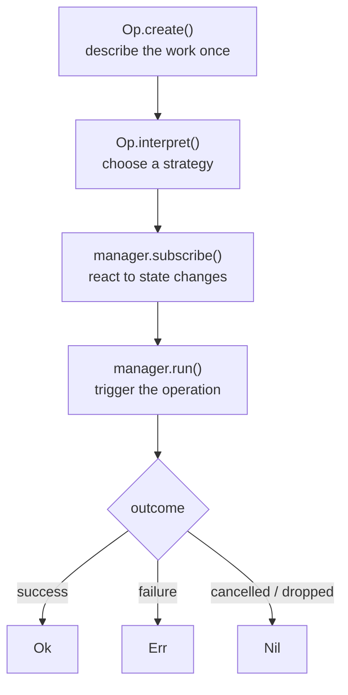
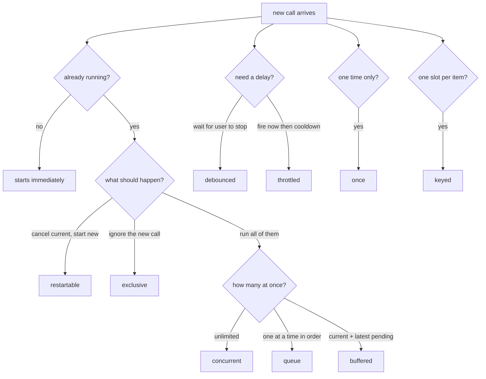
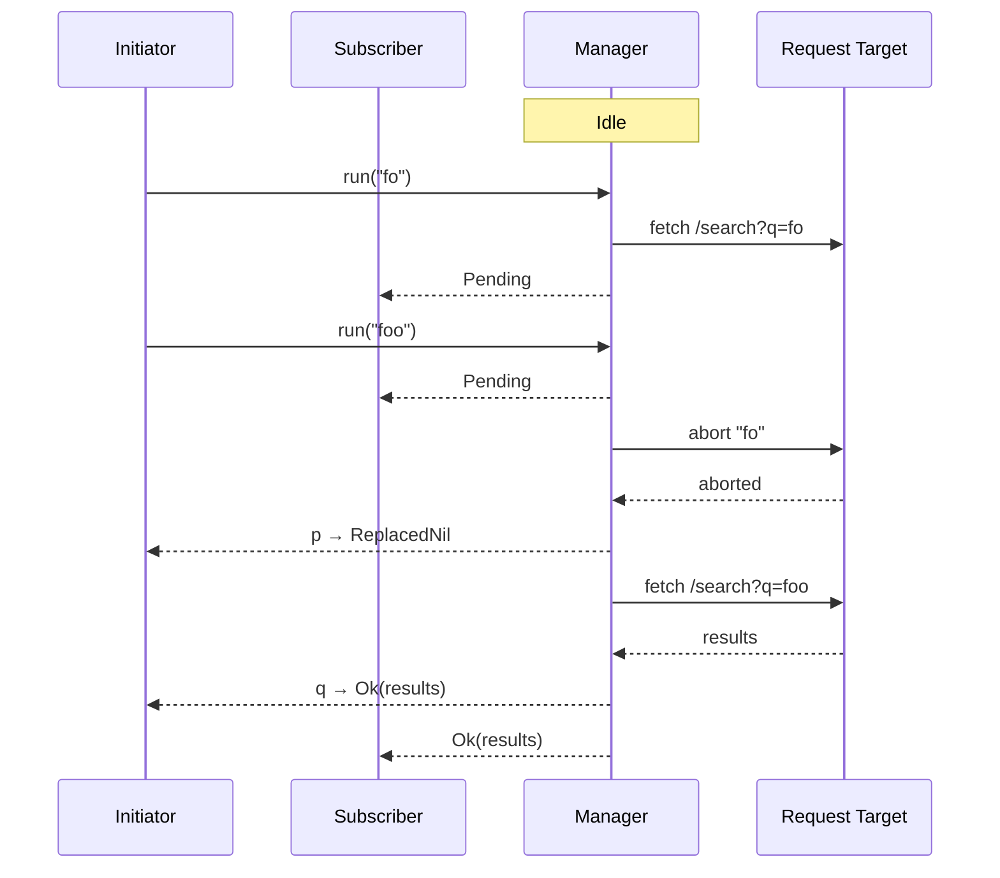

import { Aside } from '@astrojs/starlight/components'

You're building a search input. The user types and a fetch fires on every keystroke. Three requests
leave in flight simultaneously. The first one to land overwrites the result, even if it's stale.
You know the fix: cancel the previous request when a new one starts. You solve it once — then
reimplement it everywhere. But that behaviour ends up tangled into the component, the fetch call,
and a useRef keeping track of the controller.

`Op<I, E, A>` separates the problem into two independent pieces:

- **What** to do: encoded once in the `Op` via `Op.create`.
- **How** to run it: chosen at `Op.interpret` time — restartable, exclusive, queued, buffered,
  debounced, throttled, concurrent, or keyed — with retry and timeout available on top.

## Creating an Op

`Op.create` wraps an async factory and an error mapper:

```ts
import { Op } from "@nlozgachev/pipelined/core";

const searchUsers = Op.create(
  (signal) => (query: string) =>
    fetch(`/users?q=${query}`, { signal }).then((r) => {
      if (!r.ok) throw new Error(`${r.status} ${r.statusText}`);
      return r.json() as Promise<User[]>;
    }),
  (e) => new ApiError(e),
);
```

The factory receives an `AbortSignal` and returns a function that takes the input. Capture the
signal in the outer closure and thread it through to cancellable APIs like `fetch`. The error
mapper converts any thrown value into a typed error — it is never called when the operation is
aborted; aborted operations produce `Nil` instead.

If the async work lives in a standalone function, pass the signal as an explicit argument rather
than inlining the fetch:

```ts
async function searchUsers(query: string, signal: AbortSignal): Promise<User[]> {
  const r = await fetch(`/users?q=${query}`, { signal });
  if (!r.ok) throw new Error(`${r.status} ${r.statusText}`);
  return r.json();
}

const searchUsersOp = Op.create(
  (signal) => (query: string) => searchUsers(query, signal),
  (e) => new ApiError(e),
);
```

The factory shape stays the same — `(signal) => (input) => Promise<A>`. The signal reaches the
function as an argument instead of being captured in an inline closure.

<Aside type="caution">
`Op` is designed primarily for network requests. The signal is not optional plumbing: it is how every strategy tears down work it no
longer needs. Always pass it through. If you choose to ignore it, that is a deliberate trade-off:
the operation will run to completion and emit `Ok` even after the strategy has replaced or dropped
it, producing stale state.
</Aside>

Calling `create` doesn't run anything. It just defines how to run it later — nothing executes
until `Op.interpret` is called.

## Lifting a plain async function

`Op.lift` creates an `Op` from a plain async function without a custom error mapping.
Rejections are captured as `Err<unknown>`. Use it for quick wiring where a typed error
channel is not needed:

```ts
const search = Op.interpret(
  Op.lift((query: string, signal) =>
    fetch(`/search?q=${query}`, { signal }).then(r => r.json()),
  ),
  { strategy: "restartable" },
);
```

When you need a typed error — to pattern-match on a specific failure — use `Op.create` instead.

## The full lifecycle

Four steps take you from a raw `fetch` to a component that reacts to loading, success, and error
without any `useRef` or manual cancellation:

```ts
import { Op } from "@nlozgachev/pipelined/core";

// 1. create — describe the async work once
const fetchUser = Op.create(
  (signal) => (id: string) =>
    fetch(`/users/${id}`, { signal }).then((r) => {
      if (!r.ok) throw new Error(`${r.status} ${r.statusText}`);
      return r.json() as Promise<User>;
    }),
  (e) => new ApiError(e),
);

// 2. interpret — choose a concurrency strategy
const getUser = Op.interpret(fetchUser, { strategy: "once" });

// 3. subscribe — react to every state transition
getUser.subscribe((state) => {
  if (Op.isPending(state)) showSpinner();
  if (Op.isOk(state))      render(state.value);
  if (Op.isErr(state))     showError(state.error);
  if (Op.isNil(state))     resetUI();
});

// 4. run — trigger the operation; await its per-invocation outcome
const outcome = await getUser.run(userId);
```



`create` and `interpret` are called once, usually at module or component setup time.
`subscribe` registers a listener before the first `run()`. `run` is called wherever the
trigger lives — a button click, a mount hook, a route change. It returns a `Deferred` that
resolves to the outcome of that specific invocation, letting you `await` the result inline
without setting up a subscriber.

## The three outcomes

When `run()` settles, three things can happen: you get a value, you get an error, or nothing
happens — the call was cancelled, dropped, or replaced. These map to `Ok<A>`, `Err<E>`, and
`Nil`.

`Ok` and `Err` are straightforward. `Nil` is where it gets specific — the `reason` field says
exactly what happened:

- `"aborted"` — `abort()` was called explicitly.
- `"dropped"` — the call was silently ignored because the strategy had no capacity.
- `"replaced"` — a newer `run()` cancelled this one while it was already running.
- `"evicted"` — a newer `run()` took this slot before it started; the factory was never called.

`Nil.reason` means you never need external tracking to distinguish a cancellation from a capacity
drop. Code that cares can just read the field.

Constructors (`Op.ok`, `Op.err`, `Op.nil`) and guards (`Op.isOk`, `Op.isErr`, `Op.isNil`) are in
the API reference.

## Handling results

Most of the time you'll branch directly on the outcome:

```ts
const outcome = await search.run(query);

if (Op.isOk(outcome)) {
  render(outcome.value);
} else if (Op.isErr(outcome)) {
  showError(outcome.error.message);
} else {
  // Nil — call was cancelled, dropped, or replaced
  resetSearch();
}
```

If you prefer chaining, `map` transforms the success value and passes `Err` and `Nil` through
unchanged:

```ts
pipe(
  outcome,
  Op.map((users) => users.filter((u) => u.active)),
);
```

`match` is useful when you want to branch and produce a single value in one step:

```ts
Op.match({
  ok:  (users) => render(users),
  err: (e)   => showError(e.message),
  nil: ()      => resetSearch(),
})(outcome);
```

`mapError`, `chain`, `tap`, `recover`, and `fold` follow the same shape — they're in the API
reference.

## Choosing a concurrency strategy

The strategy determines what happens when `run()` is called while another invocation is already
in-flight — get this wrong and stale results can land after newer ones, or a form can submit
twice.

Not sure which strategy to pick? Four questions narrow it down:

- **One-shot**, runs exactly once → `once`
- **Multiple independent keys** (one slot per user, per row, per ID)? → `keyed`
- **Multiple simultaneous operations** at once? → `concurrent`
- **One at a time** — what happens when a new call arrives while busy?
  - Cancel the current one → `restartable`
  - Ignore the new one → `exclusive`
  - Run all in order → `queue`
  - Finish current, hold only the latest pending → `buffered`
- **Delay or rate-limit calls?**
  - Wait for quiet before starting → `debounced`
  - Fire now, then enforce a cooldown → `throttled`

If you're unsure, start with `restartable` for user input and `exclusive` for actions.



| Situation | Strategy |
| --- | --- |
| Search input / autocomplete | `restartable` |
| Form submit / payment | `exclusive` |
| Autosave / background sync | `buffered` |
| Sequential job pipeline | `queue` |
| Typing / resize pause | `debounced` |
| Scroll handler / rate limit | `throttled` |
| Parallel uploads / connection pool | `concurrent` |
| Per-item data fetch | `keyed` |
| Initial data load | `once` |

Many strategies intentionally drop or replace calls — not every `run()` produces an `Ok` or `Err`.
If every invocation must run, use `queue` or `concurrent` with `overflow: "queue"`.

`Op.interpret` returns a manager with three methods: `run(input)` fires the operation and returns
a `Deferred` for that specific invocation's outcome (`Ok`, `Err`, or `Nil`); `subscribe(cb)` is
called on every state transition; `abort()` cancels in-flight work and clears any queue. The
`Deferred` type is narrowed by strategy — a `restartable` manager can only produce `ReplacedNil`,
not `DroppedNil`, so TypeScript catches incorrect `Nil` handling at compile time.

```ts
// Load once on mount — further run() calls return DroppedNil immediately
const getUser = Op.interpret(fetchUser, { strategy: "once" });
getUser.subscribe((state) => {
  if (Op.isPending(state)) showSpinner();
  if (Op.isOk(state))      render(state.value);
});
getUser.run(userId);

// Search: only the latest result matters
const search = Op.interpret(searchUsers, { strategy: "restartable" });

// Auto-save: commit current write fully; take only the latest pending edit next
const save = Op.interpret(saveDocument, { strategy: "buffered" });

// Live validation: wait for the user to stop typing
const validate = Op.interpret(validateForm, { strategy: "debounced", duration: Duration.milliseconds(300) });
```

Full strategy reference:

| Strategy | Behaviour |
| --- | --- |
| `once` | Fires exactly once. Only the first `run()` executes; all subsequent calls resolve immediately to `DroppedNil`. State is permanently set after the operation completes. Use for initial data load, one-time setup. |
| `restartable` | New call cancels the in-flight one. Only the latest result matters. Use for search, autocomplete, navigation. |
| `exclusive` | New calls while in-flight are silently dropped. In-flight always completes. Use for form submission. |
| `queue` | Calls run in submission order. All calls eventually execute. Use for ordered processing. |
| `buffered` | 1 in-flight + 1 waiting slot. Newer calls replace the waiting slot. In-flight never cancelled. Use for auto-save. |
| `debounced` | Waits N ms of quiet before starting. Resets on every new call. Use for live search, resize handlers. |
| `throttled` | Fires immediately on the first call, then ignores calls for N ms (leading-only). With `trailing: true`, the last call during the cooldown fires once more at the trailing edge. Use for scroll handlers, rate-limited actions. |
| `concurrent` | Up to N operations in-flight simultaneously. Overflow policy is configurable: `"drop"` returns `DroppedNil` immediately; `"queue"` waits for a slot. Use for file upload managers, connection pools. |
| `keyed` | Per-input-key slots. Different keys run in parallel; same key follows a configurable `perKey` sub-strategy. `state` is a `ReadonlyMap` of each key's last known state. Use for per-item data fetching. |

### Throttled — fire and cooldown

`throttled` fires immediately on the first call, then ignores calls for the duration of the cooldown.
Unlike `debounced`, which _waits_ for quiet, `throttled` acts on the _leading edge_
and then enforces a cooldown.

```ts
// Rate-limit a button: responds instantly, then locks out for 2 s
const submitOrder = Op.interpret(placeOrder, { strategy: "throttled", duration: Duration.seconds(2) });
submitOrder.run(cart); // fires immediately → Ok
submitOrder.run(cart); // during cooldown → DroppedNil
```

Add `trailing: true` to fire once more at the end of the cooldown with the most recent input.
This is useful for scroll or resize handlers where you want an immediate response _and_ a final
update when the burst ends:

```ts
const handleResize = Op.interpret(computeLayout, {
  strategy: "throttled",
  duration: Duration.milliseconds(100),
  trailing: true,
});
// On burst: leading fires instantly; last call during cooldown fires at cooldown end.
// Calls replaced in the buffer resolve to EvictedNil; the leading fires → Ok.
```

### Concurrent — bounded parallelism

`concurrent` allows up to `n` operations in-flight simultaneously. What happens beyond that is
controlled by `overflow`:

```ts
// Upload at most 3 files at a time; queue the rest
const upload = Op.interpret(uploadFile, {
  strategy: "concurrent",
  n: 3,
  overflow: "queue",
});

// Cap at 3; drop any call that arrives when all slots are busy
const fetchPreview = Op.interpret(generatePreview, {
  strategy: "concurrent",
  n: 3,
  overflow: "drop",
});
```

With `overflow: "queue"`, callers see a `Queued` state with a `position` field while waiting
for a slot. With `overflow: "drop"`, excess calls resolve to `DroppedNil` immediately.
`abort()` cancels all in-flight operations and empties the queue.

### Keyed — per-input deduplication

Every other strategy maintains a single state machine — one `Pending`, one `Ok`, one subscriber
event at a time. `keyed` is different: it manages an independent state machine per key. The
`state` property is a map of N machines, and each subscriber callback receives a fresh snapshot
of the entire map. Think of it as N managers multiplexed through one API, not one manager that
happens to track keys.

`keyed` maintains one independent execution slot per key. A `key` function extracts the key
from each input; different keys run in parallel; the same key follows the `perKey`
sub-strategy.

```ts
const fetchUser = Op.interpret(getUserOp, {
  strategy: "keyed",
  key: (input) => input.userId,
  perKey: "exclusive", // or "restartable"
});

fetchUser.run({ userId: "a", ...rest }); // slot "a" starts
fetchUser.run({ userId: "b", ...rest }); // slot "b" starts in parallel
fetchUser.run({ userId: "a", ...rest }); // slot "a" busy — DroppedNil (exclusive)
                                         // or cancels and restarts (restartable)
```

`manager.state` is a `ReadonlyMap` of each key's last known state. The subscriber receives a
fresh snapshot on every transition:

```ts
fetchUser.subscribe((map) => {
  for (const [userId, state] of map) {
    if (Op.isPending(state)) showSpinner(userId);
    if (Op.isOk(state))      renderUser(userId, state.value);
    if (Op.isErr(state))     showError(userId, state.error);
  }
});
```

`abort(key)` cancels a specific key; `abort()` cancels all. Keys remain in the map with their
last terminal state — `Ok`, `Err`, or `Nil` — until a new `run()` updates them.

## Subscribing to state

The subscriber receives every state transition. The `S` type parameter is narrowed to only the
states reachable for the chosen strategy — TypeScript will reject handlers for states that can
never occur:

```ts
const manager = Op.interpret(searchUsers, { strategy: "restartable" });

manager.subscribe((state) => {
  // state: Idle | Pending | Ok<User[]> | Err<ApiError> | Nil
  if (Op.isIdle(state))    return;
  if (Op.isPending(state)) showSpinner();
  if (Op.isOk(state))      render(state.value);   // no unwrapping needed
  if (Op.isErr(state))     showError(state.error);
  if (Op.isNil(state))     resetSearch();
});

manager.run(query);
```

`manager.state` is always readable synchronously — useful for frameworks that need the current
value outside the subscription cycle:

```ts
// React
const state = useSyncExternalStore(
  (cb) => manager.subscribe(cb),
  () => manager.state,
);
```

One thing to watch out for: subscribing while the manager is not idle fires the callback
immediately with the current state — useful for attaching UI components after setup, but it means
`subscribe` is not a no-op even when called after an operation completes. Subscribing before the
first `run()` does not fire until something actually happens.

`abort()` resolves every outstanding `run()` Deferred — including invocations waiting in a queue
— to `AbortedNil`. Resolution is asynchronous (the Deferred settles on the next microtask tick);
no Deferred hangs indefinitely. The manager's state transitions to the appropriate terminal `Nil`
as each one settles.

## Resetting manager state

`manager.reset()` returns the manager to `Idle` without cancelling any in-flight operation.
Use it to clear displayed results or dismiss an error state without affecting a pending request:

```ts
if (userNavigatesAway) {
  manager.reset(); // clears Ok/Err state — UI resets to initial state
}
```

## Polling on an interval

`manager.poll(input, { interval })` runs the operation immediately, then every `interval`
milliseconds. It returns a stop handle:

```ts
// Poll a job status endpoint every 5 seconds
const stopPolling = statusManager.poll(jobId, { interval: 5000 });

// Stop when the job completes or the component unmounts
statusManager.subscribe(state => {
  if (Op.isOk(state) && state.value.status === "done") stopPolling();
});
```

## Per-invocation results

Every `run()` call returns a `Deferred` that resolves to the outcome of that specific invocation.
This lets you `await` a result inline — useful for imperative flows, sequential composition, and
testing.

```ts
// Sequential: submit, then navigate on success
const result = await submit.run(formData);

if (Op.isOk(result)) {
  router.push("/success");
} else if (Op.isErr(result)) {
  showError(result.error.message);
} else {
  // Nil — invocation did not produce a value
  // result.reason is "aborted", "dropped", or "replaced"
  console.log("invocation did not complete:", result.reason);
}
```

`Op.all` and `Op.race` work across multiple invocations without manual `Promise` plumbing:

```ts
// Parallel: fire two searches and wait for both
const [usersResult, postsResult] = await Op.all([
  searchUsers.run(query),
  searchPosts.run(query),
]);

// Race: take whichever finishes first
const first = await Op.race([
  fetchFromPrimary.run(id),
  fetchFromFallback.run(id),
]);
```

Each outcome in the array corresponds directly to its invocation. `Nil` is a valid outcome — the
strategy may have dropped or replaced the call.

The Nil reasons each strategy can produce:

| Strategy | Nil reasons |
| --- | --- |
| `once` | `"aborted"`, `"dropped"` |
| `restartable` | `"aborted"`, `"replaced"` |
| `exclusive` | `"aborted"`, `"dropped"` |
| `queue` | `"aborted"` only |
| `buffered` | `"aborted"`, `"evicted"` |
| `debounced` | `"aborted"`, `"evicted"` |
| `throttled` | `"aborted"`, `"dropped"`, `"evicted"` |
| `concurrent` | `"aborted"`, `"dropped"` with `overflow: "drop"` |
| `keyed` | `"aborted"`, `"dropped"` with `perKey: "exclusive"`, `"replaced"` with `perKey: "restartable"` |

State is shared across all callers; outcomes are private to the caller of that specific `run()`.
A subscriber always sees the latest state — it does not receive separate events for each
invocation. Code that needs per-invocation results should `await run()` directly:

```ts
const search = Op.interpret(searchUsers, { strategy: "restartable" });

const p = search.run("fo");   // Deferred for this specific call
const q = search.run("foo");  // cancels "fo", starts fresh

await p; // ReplacedNil — this invocation was replaced
await q; // Ok(results)  — this invocation completed

// Subscriber saw: Pending → Pending → Ok
// p's Deferred and the subscriber's view are consistent but not the same thing.
```



## Retry and timeout

Both are options on `Op.interpret`, not decorators applied to the factory. Set them once when
creating the manager — they apply to every `run()` call automatically.

Retry can be interrupted by a new call — this is usually what you want. When `restartable`
cancels a running operation mid-retry, the retry loop stops immediately and the original
invocation resolves to `ReplacedNil`.

```ts
const submit = Op.interpret(submitOrder, {
  strategy: "exclusive",
  retry: { attempts: 3, backoff: (n) => Duration.milliseconds(n * 500), when: (e) => e.isRetryable },
  timeout: { duration: Duration.seconds(10), onTimeout: () => new ApiError("timed out") },
});
```

When `retry` is present, the manager emits `Retrying` between attempts — and the subscriber type
expands to include it. A manager without a retry policy cannot produce `Retrying` states, so the
type does not include it:

```ts
// No retry — Retrying is not in the subscriber type
const m1 = Op.interpret(op, { strategy: "restartable" });
// m1.subscribe: (state: Idle | Pending | Ok<A> | Err<E> | Nil) => void

// Retry present — Retrying is added
const m2 = Op.interpret(op, { strategy: "restartable", retry: { attempts: 3 } });
// m2.subscribe: (state: Idle | Pending | Retrying<E> | Ok<A> | Err<E> | Nil) => void
```

The `timeout` wraps the entire retry sequence — one deadline for all attempts. If the deadline
fires mid-retry, the subscriber receives `Err(onTimeout())` and retrying stops. Adding `timeout`
does not change the subscriber type: it produces `Err`, which is already part of every state
union.

```ts
const search = Op.interpret(searchUsers, {
  strategy: "restartable",
  retry: { attempts: 3, backoff: Duration.milliseconds(500) },
});

const p = search.run("fo");   // starts; attempt 1 fails, backoff running
search.run("foo");             // replaces: p resolves to ReplacedNil immediately
                               // retry loop for "fo" stops — no more attempts
                               // "foo" starts fresh with a full retry budget
```

## Converting outcomes

`Op.toResult` and `Op.toMaybe` convert an `Outcome` to the library's other success/failure types.
`Nil` must be mapped to an error for `toResult` (since `Result` has no nil concept), and becomes
`None` for `toMaybe`:

```ts
import { pipe } from "@nlozgachev/pipelined/composition";

// Use in a subscriber
manager.subscribe((state) => {
  if (!Op.isOk(state) && !Op.isErr(state) && !Op.isNil(state)) return;
  const result = pipe(
    state,
    Op.toResult(() => new ApiError("cancelled")),
  );
  // result: Result<ApiError, User[]>
});
```

`Op.getOrElse` extracts the value with a fallback for `Err` and `Nil`:

```ts
const users = Op.getOrElse(() => [] as User[])(outcome);
```

## Wiring managers together

`Op.wire` subscribes to a manager and calls a handler whenever it reaches `Ok`. The
typical use is to trigger a downstream manager:

```ts
const stopWire = Op.wire(searchManager, (results) => displayManager.run(results));
// Later:
stopWire();
```

Wire is intentionally minimal — it triggers a handler on each `Ok`, nothing more. For
unified loading states across multiple managers or cancellation propagation, compose
managers at the Op level with `Op.create` using `TaskResult` pipelines.

## When to use Op

- You need a one-shot async result that runs exactly once — use `strategy: "once"`.
- You need a UI component to react to async state transitions (loading, error, success) without
  coordinating across multiple `useRef` and `useState` calls.
- You need a specific concurrency strategy: cancel old requests, drop duplicates, queue work in
  order, or debounce rapid inputs.
- You want to rate-limit an action with an immediate first response — use `strategy: "throttled"`.
- You need bounded parallelism (upload N files at a time, pool N connections) — use
  `strategy: "concurrent"`.
- You need per-item deduplication (one in-flight fetch per user ID, per row) — use
  `strategy: "keyed"`.
- You want retry and timeout configured once, not scattered across every call site.
- You need the current state readable synchronously for framework integrations like
  `useSyncExternalStore` or Svelte stores.
