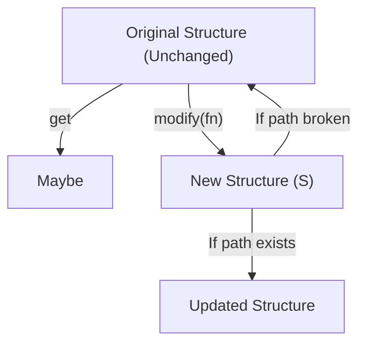

Reading deep nested structures that might be missing is a problem standard TypeScript solves
elegantly. The optional chaining operator (`?.`) allows us to navigate through potentially absent
objects without throwing runtime errors.

However, a significant gap appears when we need to update these structures. While optional chaining
allows safe reads, there is no corresponding operator for writes. There is no `?.=` operator in
JavaScript. When we want to update a value at the end of a nullable path, we are forced to write
verbose, conditional branching code filled with intermediate checks and nested object spreads.

`Optional` closes this gap. It represents a two-way path through a structure where elements along
the way may or may not exist. Reads through an optional return a `Maybe` context, while writes and
modifications automatically apply if the path is complete, and act as a safe, silent no-op if any
part of the path is missing.

## The problem with updating optional paths

Consider a system that tracks a user's notification preferences, where both the preferences
sub-object and individual notification channels are completely optional:

```ts
type UserSettings = {
  username: string;
  notifications?: {
    email?: boolean;
    slack?: {
      webhookUrl?: string;
      enabled?: boolean;
    };
  };
};

const settings: UserSettings = {
  username: "alice",
  notifications: {
    email: true,
  },
};
```

If we want to enable the Slack channel, we cannot simply write:

```ts
// Syntax Error: Optional chaining cannot be used on the left-hand side of an assignment
settings.notifications?.slack?.enabled = true;
```

To update this safely and immutably using standard JavaScript, we must manually guard each nullable
level to determine whether we need to create it or skip the update:

```ts
const updatedSettings = {
  ...settings,
  notifications: settings.notifications
    ? {
        ...settings.notifications,
        slack: settings.notifications.slack
          ? {
              ...settings.notifications.slack,
              enabled: true,
            }
          : undefined, // Or create a default Slack object
      }
    : undefined,
};
```

This code is incredibly difficult to read, write, and maintain. It forces the developer to manually
manage the control flow of absence, mixing business logic with defensive null-checking.

## The shift to nullable paths

An `Optional<S, A>` models a traversal that might fail to reach its destination.

- Reading through an optional yields `Maybe<A>` (returning `Some` if the path is valid and holds a
  value, or `None` if any segment is absent).
- Overwriting or modifying through an optional returns a new structure with the update applied if
  the path exists, or the original structure unchanged if the path is broken.



## Creating optional paths

We can target optional object properties using `Optional.prop`, and array elements by index using
`Optional.index`:

```ts
import { Optional } from "@nlozgachev/pipelined/core";

// Focus on an optional field within an object
const notificationsOptional = Optional.prop<UserSettings>()("notifications");

// Focus on a specific element of an array by index
const firstItemOptional = Optional.index<string>(0); // Optional<string[], string>
```

If we need a custom optional path — such as parsing a string value that might be empty or invalid —
we can define it manually with `Optional.make`:

```ts
import { Maybe } from "@nlozgachev/pipelined/core";

const firstCharOptional = Optional.make(
  (str: string) => str.length > 0 ? Maybe.some(str[0]) : Maybe.none(),
  (char) => (str) => str.length > 0 ? char + str.slice(1) : str
);
```

## Reading values safely

When reading a value through an `Optional`, we receive a `Maybe` context. We then use standard
functional helpers to extract or fold the value:

```ts
import { pipe } from "@nlozgachev/pipelined/composition";

const slackOptional = Optional.prop<UserSettings["notifications"]>()("slack");

// Extract the Slack settings as a Maybe context
const slackSettings = pipe(settings.notifications, Optional.get(slackOptional));
// Returns: None (since 'slack' is undefined in our settings)

// Fold the result with a fallback value using positional ordering (none handler first)
const hasWebhook = pipe(
  settings.notifications,
  Optional.fold(slackOptional)(
    () => false,                // Handle None
    (slack) => !!slack.webhookUrl // Handle Some
  )
);
```

## Modifying and writing through optionals

Writing or modifying a value through an `Optional` always returns a new object reference if the path
is resolved and a change occurs, preserving reference equality and returning the original object if
the path is broken:

```ts
const slackEnabledOptional = Optional.prop<{ webhookUrl?: string; enabled?: boolean }>()("enabled");

// Safely modify a value if it exists, otherwise do nothing
const updatedNotifications = pipe(
  settings.notifications,
  Optional.modify(slackOptional)(
    slack => ({ ...slack, enabled: true })
  )
);
// Returns the original 'notifications' reference because 'slack' was undefined.
```

## Composing deep optional paths

Just like lenses, optionals compose. We can combine multiple optional paths using
`Optional.andThen`. If any step in the composition fails, the entire chain resolves to a safe no-op
or a `None` value:

```ts
const notifications = Optional.prop<UserSettings>()("notifications");
const slack = Optional.prop<Required<UserSettings>["notifications"]>()("slack");
const webhook = Optional.prop<Required<Required<UserSettings>["notifications"]>["slack"]>()("webhookUrl");

// Compose a deep optional path
const slackWebhookOptional = pipe(
  notifications,
  Optional.andThen(slack),
  Optional.andThen(webhook)
);

// Read the deep webhook URL if it exists
const urlMaybe = pipe(settings, Optional.get(slackWebhookOptional)); // None

// Attempt to set a value deep inside the structure safely
const nextSettings = pipe(
  settings,
  Optional.set(slackWebhookOptional)("https://hooks.slack.com/services/...")
);
```

## Bridging Lenses and Optionals

It is very common for a path to start with fields that are guaranteed to exist, and then reach a
field that is optional. We can transition from a `Lens` to an `Optional` using `Lens.toOptional`, or
compose a lens directly using `Optional.andThenLens` or `Lens.andThenOptional`:

```ts
import { Lens } from "@nlozgachev/pipelined/core";

type Config = {
  server: {
    host: string;
    port: number;
    ssl?: {
      certPath: string;
    };
  };
};

const serverLens = Lens.prop<Config>()("server");
const sslOptional = Optional.prop<Config["server"]>()("ssl");

// Compose a guaranteed path with an optional path
const sslCertOptional = pipe(
  serverLens,
  Lens.toOptional,
  Optional.andThen(sslOptional)
);
```

## When to use Optional vs Lens

Use the following reference to select the correct tool for your data path:

| Situation                                                            | Tool                                        |
| :------------------------------------------------------------------- | :------------------------------------------ |
| The target property is required and always present                   | `Lens.prop`                                 |
| The target property is declared as optional (`key?: T`)              | `Optional.prop`                             |
| The target is a specific element within an array (`arr[i]`)          | `Optional.index`                            |
| The path starts with required fields and ends with an optional field | `Lens.andThenOptional` or `Lens.toOptional` |
