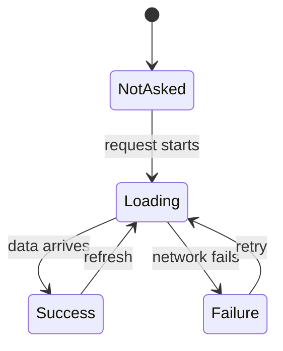

Every asynchronous data-fetching lifecycle has exactly four distinct phases: before the request
begins, while the request is in flight, when the request fails, and when the request succeeds.

In typical applications, we attempt to model these phases by distributing them across several
independent variables:

```ts
const [data, setData] = useState<User | null>(null);
const [isLoading, setIsLoading] = useState(false);
const [error, setError] = useState<Error | null>(null);
```

While this flag-based model is familiar, it is structurally fragile. Because these variables are
independent, they permit combinations of states that make no logical sense in the real world. For
example, your types allow `isLoading` to be `true` while `error` is present, or both `data` and
`error` to be `null` simultaneously.

Furthermore, this flag soup fails to name the "before it starts" state. "We haven't asked for the
data yet" is represented by `data: null`, `isLoading: false`, and `error: null`, which is identical
to the representation of "we requested it and found nothing."

`RemoteData<E, A>` solves this by modeling these lifecycles as a single, explicit data structure
containing four mutually exclusive states: `NotAsked`, `Loading`, `Failure<E>`, and `Success<A>`.



By packaging our loading state into a single, cohesive type, we ensure that our application can only
ever represent valid states.

---

## Creating RemoteData

To track a lifecycle, we transition our state through the explicit constructors of `RemoteData`:

```ts
import { RemoteData } from "@nlozgachev/pipelined/core";

type UserState = RemoteData<string, User>;

// 1. Initial idle state before any action
let state: UserState = RemoteData.notAsked();

// 2. An API request is initiated
state = RemoteData.loading();

// 3. The network times out
state = RemoteData.failure("Request timed out");

// 4. A successful reload brings data
state = RemoteData.success(activeUser);
```

---

## Exhaustive Rendering with match

The primary benefit of `RemoteData` is that it makes your rendering and consumption logic safe. When
you unpack the data, `match` requires you to handle all four branches explicitly. If you forget one,
the compiler will refuse to build your application:

```ts
import { pipe } from "@nlozgachev/pipelined/composition";

const uiMessage = pipe(
  userDataState,
  RemoteData.match({
    notAsked: () => "Click the button to load your profile",
    loading:  () => "Retrieving data...",
    failure:  (error) => `Could not load profile: ${error}`,
    success:  (user) => `Welcome back, ${user.name}`,
  }),
);
```

Because the compiler enforces that every branch is defined, you can never accidentally skip the
loading spinner or forget to handle a network failure.

If you prefer positional callbacks rather than named object fields, you can use `fold`. The
arguments are positional in the order: `failure`, `notAsked`, `loading`, `success`.

---

## Transforming States in Flight

We do not have to immediately unpack `RemoteData` to work with it. We can describe transformations
on our successful values while they are still managed within their lifecycle context.

### Pure transformations with `map`

`map` applies a transformation to the value inside a `Success` container, leaving `NotAsked`,
`Loading`, and `Failure` entirely untouched:

```ts
const userDisplayName = pipe(
  userDataState,
  RemoteData.map((user) => user.name.toUpperCase()),
);
```

If the state is `Loading`, it remains `Loading` after the `map`. The transformation is only executed
if the data has successfully arrived, allowing us to describe what should happen to the value
without worrying about whether it is loading or failed.

### Standardizing errors with `mapError`

`mapError` applies a transformation to the error inside a `Failure` container, leaving all other
states untouched. This is useful for translating low-level API error objects into user-friendly
message strings:

```ts
const cleanState = pipe(
  userDataState,
  RemoteData.mapError((apiErr) => apiErr.message),
);
```

---

## Chaining Dependent Requests

Often, one asynchronous fetch depends on the result of another — for instance, we must fetch a
user's record before we can fetch their associated posts.

For this, we use `chain`. If the current state is `Success`, `chain` passes the value to your next
fetch function and returns its result. If the state is `Loading`, `Failure`, or `NotAsked`, the step
is skipped and that state propagates automatically:

```ts
const userPostsState = pipe(
  userDataState,
  RemoteData.chain((user) => fetchPostsForUser(user.id)), // returns RemoteData
);
```

---

## Validating outcomes: filter

Sometimes a fetch succeeds, but the data does not satisfy our business constraints (e.g., a
retrieved price list is empty). We can use `filter` to convert a `Success` into a `Failure` based on
a condition:

```ts
const verifiedPrice = pipe(
  priceFetchState,
  RemoteData.filter(
    (price) => price > 0,
    (price) => `Price of ${price} is invalid. Price must be positive.`,
  ),
);
```

If the fetch succeeded with `-1`, the state is converted to `Failure("-1 is invalid...")`. If the
state was `Loading`, the check is bypassed.

---

## Extracting the value

When you simply need to extract the success value or supply a fallback if the data is loading,
absent, or failed, you can use `getOrElse`:

```ts
const theme = pipe(
  themeFetchState,
  RemoteData.getOrElse(() => "light-theme"),
);
```

---

## Side effects with tapError

To log network errors or trigger analytic alerts mid-pipeline, you can use `tapError`. It executes
your side effect only if the current state is a `Failure`, passing the error through:

```ts
pipe(
  userDataState,
  RemoteData.tapError((err) => {
    logger.error("User profile fetch failed", { error: err });
  }),
);
```

---

## Interoperability at boundaries

`RemoteData` works beautifully in UI states, but low-level API utilities usually communicate using
`Maybe` or `Result` types. You can convert between them at system boundaries.

### Downgrading to Maybe or Result

To discard all error and loading information, you can convert to `Maybe` using `toMaybe`. Only
`Success` becomes a `Some`:

```ts
const maybeUser = RemoteData.toMaybe(userDataState); // Some(user) or None
```

To convert to a `Result`, you must provide a fallback error to represent what should happen if the
data is not yet loaded:

```ts
const resultUser = pipe(
  userDataState,
  RemoteData.toResult(() => "Data has not loaded yet"),
); // Ok(user) or Err("Data has not loaded yet")
```

### Storing async outcomes with `fromResult`

When you trigger an asynchronous operation (e.g. using a `Task.Result`), you obtain a standard
`Result<E, A>` when it resolves. Storing this directly into your component's state as `RemoteData`
is highly common.

Instead of writing a verbose manual match block, you can use `fromResult` to lift the `Result` into
the `RemoteData` lifecycle:

```ts
// In your async execution block:
const result = await fetchUserProfileTask();

// Passed directly to state:
setDataState(RemoteData.fromResult(result)); // Success(user) or Failure(error)
```

---

## When to use RemoteData

### Use RemoteData when:

- **You are driving a UI**: You need to render different elements for loading spinners, error
  messages, idle states, and actual content.
- **You value state safety**: You want the compiler to prevent invalid states, like having stale
  data displayed while showing a contradictory error banner.
- **You want unified state**: Juggling three or four different state flags in your components makes
  the rendering code hard to read and trace.

### Keep using simple flags when:

- **The lifecycle has no idle or failed states**: For very simple local computations that are either
  immediately present or not (use `Maybe` or plain optional chaining instead).
