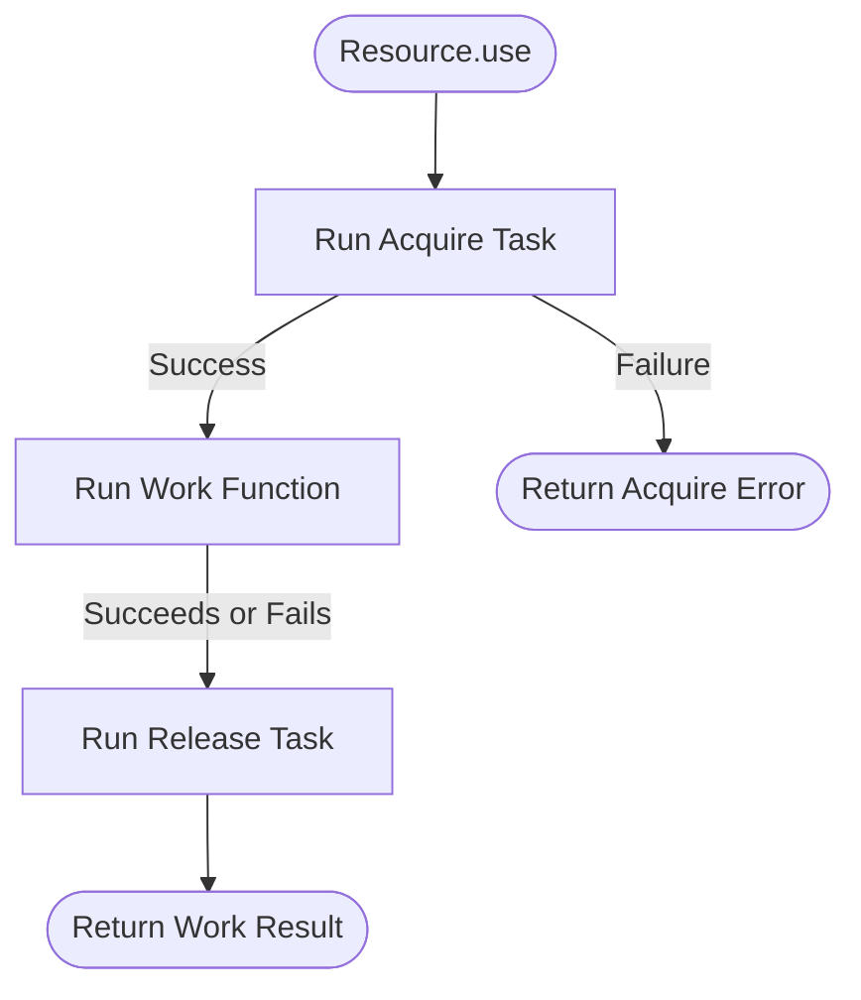

A very common sequence in software development is the acquire-use-release lifecycle. You open a
database connection, run a series of queries, and close the connection. Or you open a file handle,
read its contents, and close the handle when done.

This sequence is simple, until an error occurs. If a query throws a runtime exception, the close
instruction is skipped, causing a connection leak that will eventually crash the server.

To fix this, we typically introduce defensive blocks:

```ts
const connection = await openConnection();
try {
  await runQueries(connection);
} finally {
  await connection.close();
}
```

This works for a single resource within a narrow scope. But as applications grow, we find ourselves
composing multiple resources — like a database connection and a cache socket. Managing nested
`try/finally` blocks is extremely fragile, and passing a resource across multiple function
boundaries makes it very easy to forget who holds the responsibility to clean it up.

`Resource<E, A>` solves this structurally by implementing the **bracket pattern**. It packages the
potentially fallible `acquire` step (a `Task.Result`) and the infallible `release` step (a `Task`)
into a single, cohesive data structure.


```mermaid
flowchart TD
    Start([Resource.use]) --> Acquire[Run Acquire Task]
    Acquire -->|Success| Work[Run Work Function]
    Acquire -->|Failure| FailExit([Return Acquire Error])

    Work -->|Succeeds or Fails| Release[Run Release Task]
    Release --> WorkExit([Return Work Result])
```

By describing *how to open* and *how to close* a resource once, we delegate the execution safety to
the library. `Resource.use` guarantees that the cleanup step is always executed, whether the work
succeeds or fails.

---

## Creating a Resource

We define a resource by supplying the actions to open and close it.

```ts
import { pipe } from "@nlozgachev/pipelined/composition";
import { Resource, Task } from "@nlozgachev/pipelined/core";

const dbResource = Resource.from.handlers(
  Task.Result.tryCatch(
    () => openConnection({ host: "db.local" }),
    { onError: (error) => new Error(`DB connection failed: ${error}`) },
  ),
  (connection) => Task.tryCatch(() => connection.close(), { onError: () => {} }),
);
```

The release callback receives the exact value produced by the acquisition step. Even if a query
fails midway, the manager will execute `connection.close()` automatically.

### Resources that cannot fail

If acquiring the resource is guaranteed to succeed — such as acquiring an in-memory lock or starting
a local timer — we can use `fromTask` to skip error mapping:

```ts
const lockResource = Resource.from.Task<never, Lock>(
  Task.tryCatch(() => Promise.resolve(acquireLock("process_orders")), { onError: () => defaultLock }),
  (lock) => Task.tryCatch(() => Promise.resolve(lock.release()), { onError: () => {} }),
);
```

The error parameter is typed as `never` to formally declare to the compiler that this resource is
structurally incapable of failing to acquire.

---

## Running Actions with use

To perform work with our resource, we pass our operational logic to `Resource.use`. The work
function receives the acquired value and must return a `Task.Result`:

```ts
const products = await pipe(
  dbResource,
  Resource.use((connection) =>
    Task.Result.tryCatch(
      () => connection.query("SELECT * FROM products"),
      { onError: (error) => new Error(`Query failed: ${error}`) },
    )
  ),
)(); // Resolves to Result<Error, Product[]>
```

Let's trace the execution:

1. `dbResource` executes its `acquire` task. If this fails, the execution stops and yields the
   acquisition error.
2. If successful, the active connection is passed to the query function.
3. Whether the query succeeds or fails, the `release` task (`connection.close()`) is immediately
   executed.
4. The final result of the query (an `Ok` or `Err`) is returned.

---

## Composing Multiple Resources

When an operation requires multiple distinct resources to execute — for instance, a database
connection and a Redis cache client — we can combine them into a single, unified resource.

### Parallel acquisition with `combine`

`Resource.combine` aggregates two resources, presenting them as a single resource carrying a tuple
of both values:

```ts
const combinedResource = Resource.combine(dbResource, cacheResource);

const result = await pipe(
  combinedResource,
  Resource.use(([connection, cache]) =>
    Task.Result.tryCatch(
      async () => {
        const cached = await cache.get("profile_123");
        if (cached) return cached;

        const user = await connection.query("SELECT * FROM users WHERE id = 123");
        await cache.set("profile_123", user);
        return user;
      },
      { onError: (error) => new Error(`Database lookup failed: ${error}`) },
    )
  ),
)();
```

When combining resources, the release tasks are executed in **reverse acquisition order**: the cache
is released first, and the database is released second.

If the database is successfully opened but the cache client fails to acquire, the manager
immediately releases the database connection and returns the cache acquisition error. Your system is
guaranteed never to leak a connection mid-setup.

### Sequential nesting

For complex workflows where a second resource depends directly on the value of the first (e.g.
initiating a transaction on an active connection), you can nest `Resource.use` calls:

```ts
const result = await pipe(
  dbResource,
  Resource.use((connection) =>
    pipe(
      transactionResource(connection),
      Resource.use((transaction) =>
        Task.Result.tryCatch(
          () => executeDatabaseWrite(transaction, orderData),
          { onError: (error) => new Error(`Write failed: ${error}`) },
        )
      ),
    )
  ),
)();
```

The transaction resource will release (commit or roll back) before the database connection is
closed.

---

## Problems it solves

- **Database transaction and connection lifecycle safety**: Acquiring database connections and
  running transactional mutations requires strict cleanup: committing on success and rolling back on
  failure. `Resource` guarantees that release callbacks always execute, preventing orphaned
  connections or locked tables even when errors occur during execution.
- **Temporary files, socket descriptors, and child processes**: Batch workers and CLI tools often
  create scratch directories, open streaming file descriptors, or spawn background child processes.
  `Resource.make` binds allocation with automated cleanup, ensuring external OS assets are disposed
  of as soon as execution leaves scope.
- **Distributed mutex locks and lease coordination**: In concurrent worker clusters where jobs
  require exclusive access to shared resources, acquiring a distributed lock (e.g. via Redis) must
  be paired with guaranteed lock release upon completion or unexpected failure. `Resource`
  encapsulates lease acquisition and release into a clean, safe bracket.
- **Composing interdependent resources in reverse teardown order**: When a workflow requires
  acquiring resource A (a connection pool), resource B (a distributed lock), and resource C (a
  temporary staging file), teardown must occur in exact reverse order (C, then B, then A).
  `Resource` manages nested resource composition and enforces reverse-order cleanup automatically.
