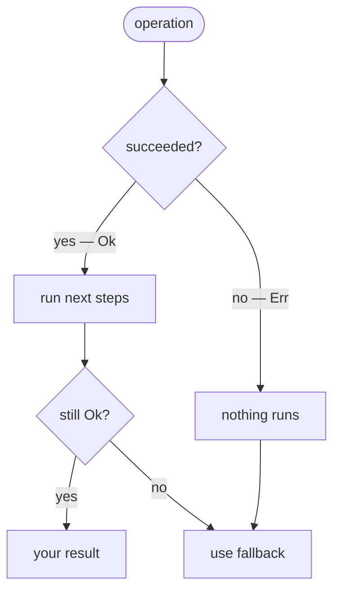
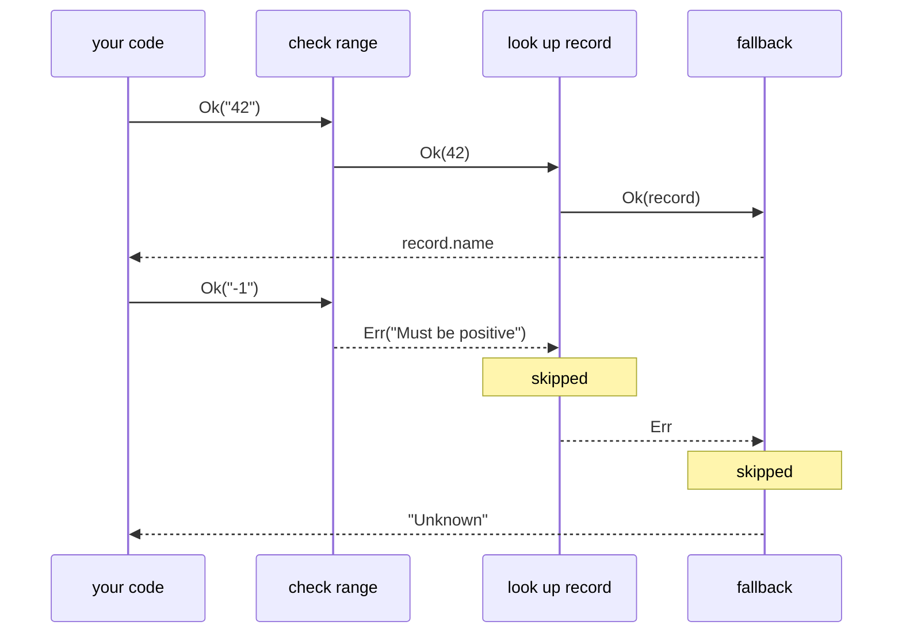

Every function that can fail has two possible outcomes, but only one is in the type signature. The
error leaks out as an exception — invisible to callers, untraceable through the type system.
`Result<E, A>` puts both outcomes in the type. Callers know an operation can fail, the compiler
tracks what's handled, and errors compose the same way values do.



## The problem with exceptions

`try/catch` has a fundamental issue: nothing in the type of a function tells you it can throw. A
function typed as `(s: string) => number` might throw at runtime, but the type gives no hint. Every
caller has to either know this and wrap in try/catch, or learn the hard way.

This leads to one of two outcomes — either error handling is scattered across every call site:

```ts
let result: number;
try {
	result = parseInput(raw);
} catch (e) {
	result = 0;
}
```

Or it's skipped entirely and exceptions bubble up to a top-level handler that can't do anything
meaningful with them.

## The Result approach

With `Result`, the possibility of failure is part of the type. A function that might fail returns
`Result<E, A>` instead of `A`. The error type `E` is explicit — callers know exactly what can go
wrong:

```ts
import { pipe } from "@nlozgachev/pipelined/composition";
import { Result } from "@nlozgachev/pipelined/core";

declare function parseInput(raw: string): Result<string, number>;

const value = pipe(
	parseInput(raw),
	Result.map((n) => n * 2), // only runs if parsing succeeded
	Result.getOrElse(() => 0), // provides the fallback
);
```

The `map` step only runs if `parseInput` returned `Ok`. If it returned `Err`, the error flows
through unchanged to `getOrElse`, which provides the fallback. No try/catch. No conditional checks.

## Creating Results

```ts
Result.ok(42); // Ok(42)  — a successful result
Result.err("not found"); // Err("not found") — a failure
```

The error type in `Result<E, A>` can be anything — a string, a discriminated union, an Error object.
You choose what fits your domain.

### Wrapping throwing code with `tryCatch`

When working with APIs that throw (like `JSON.parse`), `tryCatch` converts a throwing function into
a `Result`:

```ts
const parseJson = (s: string): Result<string, unknown> =>
	Result.tryCatch(
		() => JSON.parse(s),
		(e) => `Invalid JSON: ${e}`,
	);

parseJson('{"ok": true}'); // Ok({ ok: true })
parseJson("not json"); // Err("Invalid JSON: ...")
```

The second argument maps the caught exception to your error type, so the result is typed correctly.

### Constructing from a predicate with `fromPredicate`

When you have a value and a condition that determines whether it's valid, `fromPredicate` avoids an
explicit `if`/`else` before entering `Result`-land:

```ts
const validatePositive = Result.fromPredicate(
	(n: number) => n > 0,
	(n) => `${n} is not a positive number`,
);

pipe(validatePositive(5), Result.map((n) => n * 2)); // Ok(10)
pipe(validatePositive(-1), Result.map((n) => n * 2)); // Err("-1 is not a positive number")
```

The second argument receives the original value, so error messages can include the bad input. This
composes cleanly in pipelines where you're validating one field at a time.

## Transforming values with `map`

`map` transforms the success value, leaving `Err` untouched:

```ts
pipe(
	Result.ok(5),
	Result.map((n) => n * 2),
); // Ok(10)
pipe(
	Result.err("oops"),
	Result.map((n) => n * 2),
); // Err("oops")
```

Chaining multiple `map` calls only continues while the result remains `Ok`. The first `Err`
short-circuits the rest:

```ts
pipe(
	parseJson(input),
	Result.map((data) => data.userId),
	Result.map((id) => users.get(id)),
	Result.getOrElse(() => null),
);
```

## Transforming errors with `mapError`

`mapError` is the counterpart to `map` — it transforms the error value, leaving `Ok` untouched:

```ts
pipe(
	Result.err("connection refused"),
	Result.mapError((e) => ({ code: 503, message: e })),
); // Err({ code: 503, message: "connection refused" })
```

This is useful for normalizing errors from different sources into a single error type before they
reach the boundary of your system.

## Chaining with `chain`

When a transformation might itself fail, use `chain` instead of `map`. It prevents nested
`Result<E, Result<E, A>>`:

```ts
const validatePositive = (n: number): Result<string, number> => n > 0 ? Result.ok(n) : Result.err("Must be positive");

pipe(Result.ok(5), Result.chain(validatePositive)); // Ok(5)
pipe(Result.ok(-1), Result.chain(validatePositive)); // Err("Must be positive")
pipe(Result.err("parse failed"), Result.chain(validatePositive)); // Err("parse failed")
```

A typical pipeline chains multiple steps that can each fail independently:

```ts
pipe(
	parseInput(raw), // Result<string, string>
	Result.chain(validateRange), // Result<string, number>
	Result.chain(lookupRecord), // Result<string, Record>
	Result.map((r) => r.name), // Result<string, string>
	Result.getOrElse(() => "Unknown"),
);
```

If any step returns `Err`, subsequent steps are skipped and the error propagates to the end.

## Extracting the value

**`getOrElse`** — provide a fallback as a thunk `() => B`. The thunk is only called when the
Result is `Err`, so expensive or side-effectful defaults are never computed unnecessarily. The
fallback can be a different type, widening the result to the union of both:

```ts
pipe(Result.ok(5), Result.getOrElse(() => 0)); // 5
pipe(Result.err("oops"), Result.getOrElse(() => 0)); // 0
pipe(Result.err("oops"), Result.getOrElse(() => null)); // null — typed as number | null
```

**`match`** — handle each case explicitly. `fold` is the positional form of the same thing — error
handler first, success handler second — useful when you'd rather not name the cases:

```ts
pipe(
	result,
	Result.match({
		ok: (value) => `Success: ${value}`,
		err: (error) => `Failed: ${error}`,
	}),
);
```

## Recovering from errors

`recover` provides a fallback `Result` when the current one is `Err`. Unlike `getOrElse`, the
fallback is itself a `Result` — useful when the recovery operation might also fail. The fallback
can produce a different success type, widening the result to `Result<E, A | B>`:

```ts
pipe(
	fetchFromPrimary(url),
	Result.recover((e) => {
		console.warn("Primary failed:", e);
		return fetchFromFallback(url);
	}),
	Result.getOrElse(() => cachedValue),
);
```

`recoverUnless` lets you recover from all errors except those matching a predicate — useful when one
error type means "stop trying":

```ts
pipe(
	authenticate(token),
	Result.recoverUnless((e) => e === "REVOKED", () => refreshAndRetry(token)),
);
```

## Observing values without changing them

Sometimes you want to log, report, or track something in the middle of a pipeline without
interrupting the flow. `tap` runs a side effect on the success value and passes the `Result`
through unchanged:

```ts
pipe(
	parseConfig(input),
	Result.tap((cfg) => console.log("Config loaded:", cfg.version)),
	Result.chain(validateConfig),
	Result.map(buildApp),
);
```

`tapError` does the same on the error side — useful for logging failures without breaking the
pipeline or losing the error for downstream handling:

```ts
pipe(
	parseConfig(input),
	Result.tapError((e) => console.error("Config parse failed:", e)),
	Result.chain(validateConfig),
);
```

Both `tap` and `tapError` always return the original `Result` — they never change the value or the
error, and they never turn an `Ok` into an `Err` or vice versa.

## Converting to Maybe

When you only care about whether an operation succeeded — not why it failed — convert to `Maybe`:

```ts
Result.toMaybe(Result.ok(42)); // Some(42)
Result.toMaybe(Result.err("oops")); // None
```

The error is discarded. Use this at boundaries where you want to fall back to `Maybe`-based logic.

One thing to watch out for: errors don't accumulate in a `Result` chain — if `validateName` and
`validateEmail` both fail, you'll only see the first. For collecting all failures at once, use
`Validation` instead.



## When to use Result vs try/catch

Use `Result` when:

- The function is part of a pipeline and callers need to compose over success or failure
- Multiple operations can fail and you want a single linear flow rather than nested try/catch
- The error type matters — you want callers to know what can go wrong from the type signature alone

Keep using try/catch when:

- You're handling truly unexpected runtime errors (out of memory, unrecoverable state)
- You're at the very top of the call stack and just need to log and exit
- You're interfacing with code that expects exceptions (use `tryCatch` at the boundary to convert
  back to `Result`)
