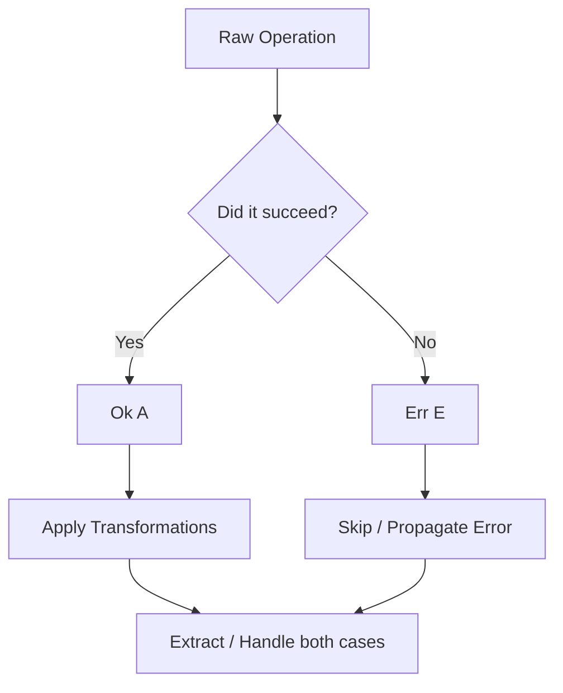

Every function that can fail has two possible outcomes: it either succeeds and returns a value, or
it fails and returns an error. Yet, in traditional JavaScript, only the success outcome is visible
in the function’s type signature. The failure is treated as an exceptional event, thrown out of the
call stack as a runtime exception.

This model has a fundamental structural flaw: exceptions are invisible to the type system. A
function typed as `(id: string) => User` might throw at runtime if the database is down or the id is
invalid, but nothing in its type forces the caller to handle that failure. Callers must either read
the source code, read outdated documentation, or learn the hard way when the application crashes in
production.

`Result<E, A>` solves this by making the possibility of failure an explicit, first-class value. It
puts both outcomes inside the type system: `Ok<A>` representing a successful value, and `Err<E>`
representing a typed error.



By turning exceptions into a data structure, we can chain operations safely. If any step fails, the
error flows through to the end of the pipeline automatically, while the happy path is skipped. We
decouple the logic of what we want to do from the logic of handling failures.

---

## Creating Results

To work within a typed error pipeline, we must wrap our synchronous operations in a `Result` context
at the boundaries of our system.

```ts
import { Result } from "@nlozgachev/pipelined/core";

// Representing a successful outcome
const success = Result.ok(42); // Result<never, number>

// Representing a specific failure
const failure = Result.err("Connection timed out"); // Result<string, never>
```

### Wrapping throwing code with `tryCatch`

Most JavaScript libraries and built-in runtime APIs (like `JSON.parse` or filesystem operations)
rely on exceptions. `Result.tryCatch` wraps these unsafe, throwing operations and converts them into
a clean `Result`:

```ts
const parseJson = (s: string): Result<string, unknown> =>
  Result.tryCatch(
    () => JSON.parse(s),
    (error) => `Malformed JSON payload: ${error}`,
  );
```

The second argument is a mapper function that intercepts the thrown exception (which is of type
`unknown`) and converts it into your designated error type `E`.

### Constructing from predicates with `fromPredicate`

When you have a plain value and a condition that determines whether that value is valid,
`Result.fromPredicate` lifts the value into `Result` without requiring an explicit `if/else` block:

```ts
const validateAge = Result.fromPredicate(
  (n: number) => n >= 18,
  (n) => `Age ${n} is below the required threshold of 18`,
);
```

The second argument receives the original input, allowing you to format descriptive, context-rich
error messages.

---

## Transforming values

Once our data is wrapped inside a `Result`, we can describe transformations on both the success and
failure branches independently.

### Pure transformations with `map`

`map` transforms the value inside an `Ok` success container, leaving `Err` failures untouched:

```ts
import { pipe } from "@nlozgachev/pipelined/composition";

const double = (n: number) => n * 2;

pipe(Result.ok(5), Result.map(double));     // Ok(10)
pipe(Result.err("oops"), Result.map(double)); // Err("oops")
```

If you chain multiple `map` steps, they will continue to execute sequentially as long as the
pipeline remains successful. The moment an `Err` is encountered, all subsequent `map` calls are
bypassed:

```ts
const route = pipe(
  parseJson(input),
  Result.map((payload) => payload.userId),
  Result.map((id) => `/users/${id}`),
);
```

### Pure error transformation with `mapError`

Sometimes you want to standardize or translate errors before passing them upstream. `mapError`
transforms the error inside an `Err` container, leaving `Ok` success values untouched:

```ts
const apiError = pipe(
  Result.err("connection_refused"),
  Result.mapError((code) => ({
    status: 503,
    message: `Database offline: ${code}`,
  })),
); // Err({ status: 503, message: "Database offline: connection_refused" })
```

This is especially valuable at the edge of your systems, allowing you to convert low-level database
or network errors into clean, user-facing error objects.

### Nested pipelines with `chain`

When a transformation step itself can fail and returns another `Result`, using `map` would result in
a nested type: `Result<E, Result<E, A>>`.

To prevent this nesting, we use `chain` to apply the transformation and flatten the context:

```ts
const validateUserExists = (id: string): Result<string, User> =>
  db.has(id) ? Result.ok(db.get(id)) : Result.err(`User ${id} not found`);

const userProfile = pipe(
  parseJson(input),                        // Result<string, unknown>
  Result.map((payload) => payload.userId), // Result<string, string>
  Result.chain(validateUserExists),        // Result<string, User>
);
```

If `parseJson` fails, the error short-circuits the pipeline immediately. If it succeeds, the
resulting `userId` is passed to `validateUserExists`. If that lookup fails, the new error is
returned. The pipeline reads as a single, linear progression of operations that can each
independently fail.

---

## Extracting the value

Eventually, we must unpack our `Result` to interface with the rest of our application.

### Safe defaults with `getOrElse`

`getOrElse` extracts the success value from an `Ok`, or returns a fallback value if we have an
`Err`:

```ts
pipe(
  Result.ok(5),
  Result.getOrElse(() => 0),
); // 5

pipe(
  Result.err("failed"),
  Result.getOrElse(() => 0),
); // 0
```

`getOrElse` takes a deferred function (a thunk) to construct the fallback. This ensures that
expensive operations, like reading a default value from a config file or instantiating a fallback
cache, are only executed if a failure actually occurred.

### Case analysis with `match` and `fold`

To perform distinct business logic on both the success and failure branches, you can use `match` for
a named object mapping, or `fold` for an error-first positional callback:

```ts
// Using match with named branches
const message = pipe(
  userProfile,
  Result.match({
    ok: (user) => `Welcome back, ${user.name}`,
    err: (error) => `Login failed: ${error}`,
  }),
);

// Using fold (error-first positional convention)
const status = pipe(
  userProfile,
  Result.fold(
    (error) => `Failure: ${error}`,
    (user) => `Success: ${user.id}`,
  ),
);
```

---

## Side effects with tap

When you want to perform a side effect — like logging a warning or emitting an analytics event —
without altering the data or breaking the flow, you can use `tap` and `tapError`.

`tap` runs its callback only on a successful `Ok` value:

```ts
pipe(
  userProfile,
  Result.tap((user) => console.log(`User ${user.id} accessed profile`)),
);
```

`tapError` runs its callback only on an `Err` failure:

```ts
pipe(
  userProfile,
  Result.tapError((err) => console.error(`Profile access failed: ${err}`)),
);
```

Both operators always return the original, unaltered `Result` to the next step of the pipeline.

---

## Recovering from None

When an operation fails, you don't always want to settle for a static default. Often, you want to
attempt an alternative strategy that could also fail. For this, we use `recover`:

```ts
const loadConfig = (path: string): Result<string, Config> =>
  pipe(
    readLocalConfig(path),
    Result.recover((error) => {
      console.warn(`Local config failed: ${error}. Retrying remote...`);
      return fetchRemoteConfig(path);
    }),
  );
```

If the primary read succeeds, the recovery lookup is bypassed. If it fails, the recovery lookup is
tried.

If there are certain fatal errors that you should *never* attempt to recover from, you can use
`recoverUnless`. It takes a predicate to decide whether to let the error propagate without
attempting recovery:

```ts
pipe(
  authenticate(credentials),
  Result.recoverUnless(
    (err) => err === "ACCOUNT_SUSPENDED", // Do not recover if suspended
    () => refreshSession(),
  ),
);
```

---

## Converting to and from Maybe

`Result` and `Maybe` are structurally highly compatible. The only difference is that `Result`
carries a typed reason for its failure, whereas `Maybe` models pure absence.

To discard the error context and convert to a `Maybe`:

```ts
const maybeValue = Result.toMaybe(Result.ok(42)); // Some(42)
const empty = Result.toMaybe(Result.err("oops")); // None
```

Conversely, if you want to lift a `Maybe` into a `Result`, you must supply a typed error to replace
the implicit absence of a `None`:

```ts
import { Maybe } from "@nlozgachev/pipelined/core";

const resultValue = pipe(
  Maybe.none(),
  Maybe.toResult(() => "Value was absent"),
); // Err("Value was absent")
```

---

## When to use Result vs try/catch

The choice between typed results and runtime exceptions is a structural architectural decision.

### Use Result when:

- **The failure is expected**: Validating input, parsing configurations, or lookup misses are
  typical domain events, not structural system failures.
- **The error type matters**: You want callers of a module to immediately know what can go wrong and
  be forced by the compiler to handle it.
- **You value composition**: You are building linear chains of operations using `pipe` where
  failures should propagate naturally.

### Keep using try/catch when:

- **The error is catastrophic**: Database connection dropouts, out-of-memory errors, or system
  initialization failures represent unrecoverable states where the process should log and exit
  immediately.
- **The boundary expects it**: When interfacing with external codebases, framework routers, or
  third-party libraries that rely on throwing exceptions. Convert exceptions to `Result` immediately
  at these boundaries.
