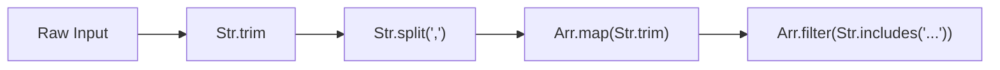

Strings are the primary medium for untrusted data entering our applications. Whether we are parsing
HTTP headers, processing CSV uploads, or cleaning up user-submitted text fields, string
transformation is a constant necessity.

In standard JavaScript, the `String` prototype offers a wide array of methods. However, because
these methods are "data-first" — called directly on the string object itself — they do not compose
cleanly. When we write functional pipelines using `pipe`, we are forced to wrap prototype calls in
anonymous arrow functions (e.g., `s => s.trim()`), which breaks the natural flow of data and
introduces visual noise.

`Str` provides standard string operations as pure, curried, data-last functions. It turns prototype
operations into modular building blocks that fit seamlessly into pipelines, alongside safe numeric
parsers that model parsing failures using the `Maybe` type.

## The problem with prototype chaining and unsafe parsing

Consider a backend handler that parses a comma-separated list of tags from a form submission:

```ts
function parseTags(rawInput: string): string[] {
  return rawInput
    .trim()
    .split(",")
    .map(tag => tag.trim())
    .filter(tag => tag.length > 0)
    .map(tag => tag.toLowerCase());
}
```

This prototype-chaining approach is familiar, but it only works when the operations are methods on
the string class. The moment we want to mix in custom helpers, external validations, or conditional
transformations, the chain breaks. We are forced to intercept the chain or assign intermediate
variables:

```ts
// If we want to add custom filtering or safe type conversions, the clean prototype chain is broken.
const trimmed = rawInput.trim();
const parts = trimmed.split(",");
// ...
```

Furthermore, standard parsing functions like `parseInt` are unsafe: they return `NaN` when given
invalid input, which silently propagates through calculations and eventually causes runtime errors
far from the source of the bad data.

## The shift to pipeline-ready operations

`Str` treats string transformations as independent, modular steps. By shifting the data argument to
the last position and currying the parameters, string operations can be composed point-free directly
inside `pipe`.



## Transforming cases and cleaning input

Basic formatting operations are wrapped as pure functions that fit cleanly into array
transformations and pipe flows:

```ts
import { Str } from "@nlozgachev/pipelined/utils";
import { pipe } from "@nlozgachev/pipelined/composition";

// Case conversions
Str.toUpperCase("hello"); // "HELLO"
Str.toLowerCase("WORLD"); // "world"
Str.capitalize("hello world"); // "Hello world"

// Trimming whitespace
Str.trim("  user input  "); // "user input"
```

## Splitting and segmenting text

Standard JavaScript `split` returns a plain array, but handles multi-line endings and multiple
spaces awkwardly. `Str` provides robust segmentation helpers:

```ts
// Standard split by character or RegExp
pipe("a,b,c", Str.split(",")); // ["a", "b", "c"]

// Split a string into lines, automatically handling \n, \r, and \r\n line endings
const logContent = "line1\nline2\r\nline3";
Str.lines(logContent); // ["line1", "line2", "line3"]

// Split text into words, automatically trimming and filtering out empty whitespace elements
const description = "  systems   thinking  ";
Str.words(description); // ["systems", "thinking"]
```

## Replacing text

`Str.replace` and `Str.replaceAll` are curried wrappers around native string replacement. They
accept the search pattern and replacement string first, leaving the target string for last:

```ts
const text = "server-prod-01";

// Replace the first occurrence
const testServer = pipe(text, Str.replace("prod", "test"));
// "server-test-01"

// Replace every occurrence of a pattern
const anonymised = pipe("123-456-789", Str.replaceAll(/\d/g, "X"));
// "XXX-XXX-XXX"
```

## Reusable predicates for filtering

String matching operations function as curried predicates, which can be passed directly to array
filters:

```ts
import { Arr } from "@nlozgachev/pipelined/utils";

const files = ["index.ts", "utils.ts", "README.md", "package.json"];

// Find all TypeScript source files
const tsFiles = pipe(
  files,
  Arr.filter(Str.endsWith(".ts"))
); // ["index.ts", "utils.ts"]
```

## Safe numeric parsing

`Str.parse` provides two safe alternatives to standard number parsing. Both `Str.parse.int` and
`Str.parse.float` inspect the string and return a `Maybe<number>` context, eliminating the need for
boilerplate `isNaN` checks:

```ts
import { Maybe } from "@nlozgachev/pipelined/core";

// Safe integer parsing (truncates decimals like parseInt)
Str.parse.int("42");  // Some(42)
Str.parse.int("3.7"); // Some(3)
Str.parse.int("abc"); // None

// Safe float parsing
Str.parse.float("3.14"); // Some(3.14)
Str.parse.float("abc");  // None
```

These safe parsers compose cleanly to resolve safe fallback defaults:

```ts
const rawLimit = "invalid";

const limit = pipe(
  rawLimit,
  Str.parse.int,
  Maybe.getOrElse(() => 10) // default to 10 on parsing failure
); // 10
```

## Composing a string pipeline

By combining these utilities, we can assemble multi-step text cleanup pipelines that are
self-documenting and highly maintainable:

```ts
const dirtyInput = "   typescript,  functional, , , pipe   ";

const cleanedTags = pipe(
  dirtyInput,
  Str.trim,
  Str.split(","),
  Arr.map(Str.trim),
  Arr.filter(tag => tag.length > 0),
  Arr.map(Str.toLowerCase)
);
// ["typescript", "functional", "pipe"]
```

## When to use Str vs prototype methods

### Use Str when

- You are transforming strings within a functional pipeline using `pipe` and want to keep a
  consistent point-free style.
- You are mapping or filtering collections of strings and want clean, named predicates instead of
  inline lambdas.
- You are parsing numeric strings and want to handle validation safety explicitly using the `Maybe`
  type.
- You need to parse multi-line inputs or space-separated lists, utilizing `lines` and `words` to
  handle edge cases automatically.

### Use prototype methods when

- You are writing a simple, self-contained statement in imperative code where direct method calls
  are highly readable.
- You need locale-sensitive comparisons or transformations (e.g. `localeCompare`,
  `toLocaleLowerCase`).
