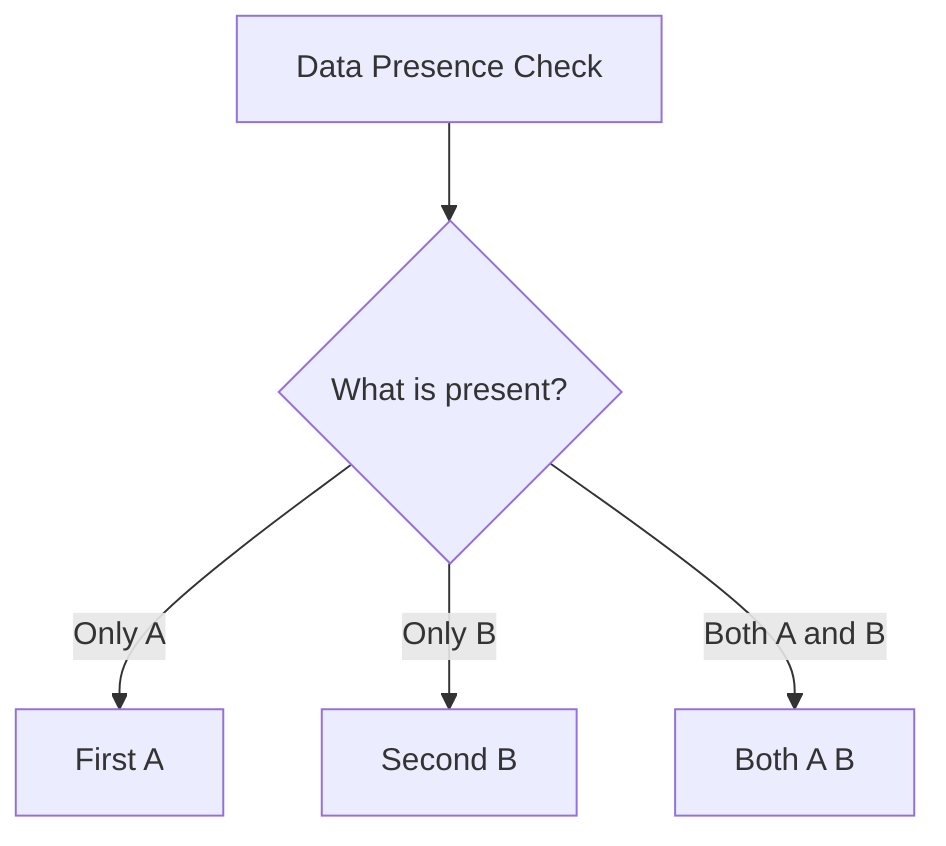

In software modeling, we typically combine types in two common ways.

The first is when **both** values must always be present. We do this every day using standard
objects or tuples:

```ts
type User = { name: string; age: number }; // both must be present
```

The second is when we have **one value or the other, but never both**. We do this using standard
union types or `Result<E, A>`:

```ts
type Status = "active" | "inactive"; // one or the other
```

But what about the inclusive-OR? What if you need to represent a situation where you might have
value A, you might have value B, or you might have both coexisting simultaneously?

This is the purpose of `These<A, B>`. It is the structural representation of the inclusive-OR,
offering three distinct variants:

- `First(a)` — only the first value is present.
- `Second(b)` — only the second value is present.
- `Both(a, b)` — both the first and second values are present.



`These` is a neutral, structural domain-modeling type. It does not carry any success, failure, or
implicit error connotations. Neither side is privileged.

---

## Structural Modeling: Domain Examples

### 1. Contact Information

Suppose you are designing a notification service that requires contact details. A user can register
their email address `A`, their phone number `B`, or both `Both(A, B)`. Representing this with
standard union types or optional fields is fragile because it permits the invalid state of having
neither.

With `These`, the type system enforces that at least one contact channel is present:

```ts
import { These } from "@nlozgachev/pipelined/core";

type ContactDetails = These<EmailAddress, PhoneNumber>;

const emailOnly = These.first(email);       // Email only
const phoneOnly = These.second(phone);      // Phone only
const both = These.both(email, phone);      // Both channels available
```

### 2. Local and Remote Synchronization

Suppose you are building a database synchronizer that reconciles local and remote changes. When
comparing records, three outcomes are structurally possible:

- Only local changes exist: `First(local)`
- Only remote changes exist: `Second(remote)`
- Both local and remote changes exist and must be merged: `Both(local, remote)`

```ts
interface UserRecord { id: string; name: string }

const reconcile = (local: UserRecord | null, remote: UserRecord | null): These<UserRecord, UserRecord> => {
  if (local && !remote) return These.first(local);
  if (!local && remote) return These.second(remote);
  if (local && remote)  return These.both(local, remote);
  throw new Error("Cannot reconcile when both sources are empty");
};
```

---

## Transforming Values

Because `These` carries two distinct type parameters, we can map over either or both sides
independently.

### Mapping the first side with `mapFirst`

`mapFirst` transforms the value inside a `First` or a `Both` container, leaving `Second` entirely
untouched:

```ts
import { pipe } from "@nlozgachev/pipelined/composition";

const formatEmail = (email: EmailAddress) => email.toLowerCase();

pipe(These.first(email), These.mapFirst(formatEmail));      // First(formattedEmail)
pipe(These.both(email, phone), These.mapFirst(formatEmail)); // Both(formattedEmail, phone)
pipe(These.second(phone), These.mapFirst(formatEmail));     // Second(phone)
```

### Mapping the second side with `mapSecond`

`mapSecond` transforms the value inside a `Second` or a `Both` container, leaving `First` untouched:

```ts
const formatPhone = (phone: PhoneNumber) => phone.trim();

pipe(These.second(phone), These.mapSecond(formatPhone));  // Second(formattedPhone)
pipe(These.both(email, phone), These.mapSecond(formatPhone)); // Both(email, formattedPhone)
```

### Mapping both sides with `mapBoth`

`mapBoth` allows you to transform both paths simultaneously:

```ts
pipe(
  These.both(email, phone),
  These.mapBoth(formatEmail, formatPhone),
); // Both(formattedEmail, formattedPhone)
```

---

## Chaining Transformations

Chaining operations over a `These` requires careful attention to what should happen to coexisting
values.

`chainFirst` passes the first value to the next step, leaving `Second` unchanged. When the input is
a `Both` variant, the coexisting second value is dropped, and the pipeline yields whatever the next
step returns:

```ts
const lookupEmailMetaData = (email: string): These<EmailMeta, PhoneNumber> => 
  These.first(fetchMetadata(email));

pipe(
  These.both("alice@example.com", "+15550199"),
  These.chainFirst(lookupEmailMetaData),
); // First(EmailMeta) — phone number is discarded
```

If you need the second value to survive the chain, you must use pure maps rather than monadic
chains.

`chainSecond` performs the symmetric operation, chaining over the second value while leaving `First`
unchanged:

```ts
const validatePhone = (phone: string): These<EmailAddress, PhoneMeta> => ...
```

---

## Extracting Values

When you reach the boundary of your pipeline, you must unpack `These` into standard TypeScript
primitives.

### Exhaustive matching with `match` and `fold`

`match` requires you to handle all three possible variants explicitly, ensuring that coexisting
values are never accidentally lost:

```ts
const notificationTarget = pipe(
  contactDetails,
  These.match({
    first: (email) => `Send email to ${email}`,
    second: (phone) => `Send SMS to ${phone}`,
    both: (email, phone) => `Send email to ${email} and SMS to ${phone}`,
  }),
);
```

For positional callbacks, `fold` provides an un-named positional mapping alternative.

### Safe fallbacks with `getFirstOrElse` and `getSecondOrElse`

If you only want to extract one side of the container and provide a fallback if it is absent:

```ts
// Extract the email (available in First or Both), or fallback
pipe(These.second(phone), These.getFirstOrElse(() => defaultEmail)); // defaultEmail

// Extract the phone (available in Second or Both), or fallback
pipe(These.first(email), These.getSecondOrElse(() => defaultPhone)); // defaultPhone
```

---

## Direct Inspection: Type Guards

To check which variant is active without unpacking the full structure, `These` provides several type
guards:

```ts
These.isFirst(value);  // true if First only
These.isSecond(value); // true if Second only
These.isBoth(value);   // true if Both

These.hasFirst(value);  // true if First or Both
These.hasSecond(value); // true if Second or Both
```

---

## Utilities

### Flipping roles: swap

`swap` reverses the first and second values of the container:

```ts
These.swap(These.first(email));         // Second(email)
These.swap(These.both(email, phone));   // Both(phone, email)
```

### Peeking with tap

`tap` allows you to execute a side-effectful callback on the first value of a `First` or `Both`
container, leaving the original `These` unchanged:

```ts
pipe(
  These.both(email, phone),
  These.tap((e) => console.log(`Sending system check to ${e}`)),
);
```

---

## When to use These

### Use These when:

- **Modeling an inclusive-OR relation**: You have two independent values of different types where
  *any combination is possible and valid*, and neither side represents an error or an exception.
- **Reconciling dual sources**: Synchronizing records between two independent data sources (like
  local and remote databases) where edits can exist in either or both.

### Keep using Result instead when:

- **The states are mutually exclusive**: The operation represents a strict success-or-failure
  outcome. If an error occurs, there is no useful success data to preserve.
