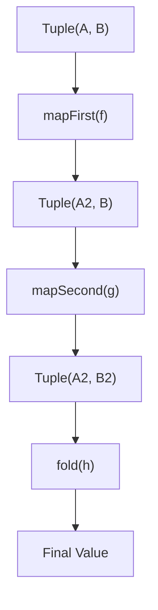

We frequently encounter data that naturally belongs together in pairs: a configuration key and its
value, a product SKU and its price, or a coordinate of latitude and longitude.

In standard JavaScript and TypeScript, we represent these associations using either small object
literals or native two-element arrays (tuples). However, when we need to transform only one side of
a pair within a functional pipeline — such as converting a price from cents to dollars while
preserving the SKU — we are forced to write verbose destructuring and reconstruction code:

```ts
const adjustPrice = ([sku, priceCents]: [string, number]): [string, number] => [
  sku,
  priceCents * 1.2 // Apply tax to the second element
];
```

This inline destructuring introduces visual noise, forces us to declare temporary local variables,
and breaks the clean flow of point-free composition.

`Tuple` treats typed pairs (`readonly [A, B]`) as first-class, unified containers. It provides
data-last operations to transform either side independently, modify both sides at once, or collapse
the pair into a single value, ensuring that paired values travel cleanly through pipelines.

## The problem with manual tuple destructuring

Suppose we are building a localization system that formats currency amounts based on a user's
locale. We represent this as a pair of `[locale, cents]`:

```ts
const userSelection: [string, number] = ["en-US", 4999];
```

If we want to apply a discount to the cents, convert them to a decimal amount, and then format them
using the native `Intl.NumberFormat` API, an imperative implementation must constantly unpack and
pack the pair:

```ts
function formatUserSelection(pair: [string, number]): string {
  const [locale, cents] = pair;
  const discountedCents = cents * 0.9;
  const dollars = discountedCents / 100;

  return new Intl.NumberFormat(locale, { style: "currency", currency: "USD" })
    .format(dollars);
}
```

While functional programming encourages us to compose small, single-responsibility steps, manual
array destructuring forces us to manage the internal indices of the array at each stage, leading to
rigid code that is difficult to refactor.

## The shift to first-class pairs

A `Tuple<A, B>` is a structural alias for a `readonly [A, B]` array. Because it is a plain
TypeScript tuple under the hood, any native two-element array is automatically a valid `Tuple`.

`Tuple` provides dedicated, pure operations that manipulate this structure without requiring us to
unpack it manually until the very end of the pipeline.


```mermaid
flowchart TD
    A["Tuple(A, B)"] --> B["mapFirst(f)"]
    B --> C["Tuple(A2, B)"]
    C --> D["mapSecond(g)"]
    D --> E["Tuple(A2, B2)"]
    E --> F["fold(h)"]
    F --> G["Final Value"]
```

## Creating pairs

To lift two distinct values into a typed pair, we use `Tuple.from.pair`:

```ts
import { Tuple } from "@nlozgachev/pipelined/core";

const entry = Tuple.from.pair("timeout_seconds", 30); // readonly [string, number]
```

Any standard two-element array (such as those returned by `Object.entries()`, `Arr.zip`, or
`Arr.splitAt`) is already structurally compatible with `Tuple` and requires no constructor wrapping.

## Reading and swapping elements

We can extract elements from a pair using `Tuple.first` and `Tuple.second`, or reverse their order
using `Tuple.swap`:

```ts
const pair = Tuple.from.pair("port", 8080);

Tuple.first(pair);  // "port"
Tuple.second(pair); // 8080

// Swap positions: [A, B] -> [B, A]
const swapped = Tuple.swap(pair); // [8080, "port"]
```

## Transforming one or both sides

`Tuple` allows us to apply mapping functions to either element independently without affecting the
other, or to transform both elements simultaneously:

```ts
import { pipe } from "@nlozgachev/pipelined/composition";

const userScore = Tuple.from.pair("alice", 980);

const updatedScore = pipe(
  userScore,
  // 1. Transform the first element (name to uppercase)
  Tuple.mapFirst(name => name.toUpperCase()),
  // ["ALICE", 980]

  // 2. Transform the second element (increment score)
  Tuple.mapSecond(score => score + 20)
  // ["ALICE", 1000]
);

// 3. Transform both elements at the same time
const scaledScore = pipe(
  userScore,
  Tuple.mapBoth(
    name => `@${name}`,
    score => score * 10
  )
); // ["@alice", 9800]
```

## Collapsing a pair into a single value

When we reach the edge of our pipeline and need to consume both values to produce a single result,
we use `Tuple.fold`. It applies a binary function that merges the two elements:

```ts
const localizedPrice = pipe(
  Tuple.from.pair("fr-FR", 1299),
  Tuple.mapSecond(cents => cents / 100), // convert to Euros
  Tuple.fold((locale, euros) =>
    new Intl.NumberFormat(locale, { style: "currency", currency: "EUR" }).format(euros)
  )
); // "12,99 €"
```

## Side effects and conversion

If we need to inspect the values inside a pipeline without altering them (e.g. for logging), we can
use `Tuple.tap`. When interfacing with APIs that do not support tuple types, we can convert the pair
to a plain array using `Tuple.to.Array`:

```ts
const loggedPair = pipe(
  Tuple.from.pair("debug_flag", true),
  Tuple.tap((key, val) => console.log(`Config: ${key} is ${val}`)),
  Tuple.to.Array
); // logs "Config: debug_flag is true", returns ["debug_flag", true]
```

## Problems it solves

- **Threading paired values through data pipelines**: In workflows where two values travel together
  (such as key/value pairs, coordinate points, or authentication tokens paired with expiration
  timestamps), transforming one or both values inside `pipe` with native arrays requires manual
  destructuring and rebuilding. `Tuple.mapFirst`, `Tuple.mapSecond`, and `Tuple.mapBoth` transform
  tuple elements point-free.
- **Key-value pair swapping for inverted indexes (`Tuple.swap`)**: When building inverse lookup
  dictionaries from key-value entries (such as mapping IDs to usernames, then inverting to map
  usernames to IDs), `Tuple.swap` flips pair positions cleanly inside array pipelines.
- **Processing zipped collection pairs**: When combining two datasets using `Arr.zip` (such as
  pairing CSV header names with row values, or timestamps with metric samples), `Tuple` combinators
  enable modular mapping, swapping, and filtering over the resulting pairs.
- **Bridging paired data with multi-argument functions (`Tuple.curry`, `Tuple.uncurry`)**: Adapting
  binary domain functions (like `calculateDistance(x, y)`) to accept tuple structures directly from
  upstream pipelines without manual glue functions.
- **Atomic pair folding**: Collapsing two-element pairs into computed domain objects or formatted
  strings using `Tuple.fold` without manual index accesses or temporary variables.
