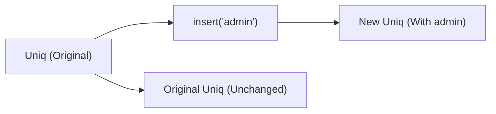

import { Aside } from '@astrojs/starlight/components'

Uniqueness is a common requirement in data modeling. We often need to track a collection of items where duplicates have no meaning—such as a list of active user roles, a set of enabled feature flags, or a collection of tags assigned to an article.

In standard JavaScript, the native `Set` object provides this behavior. However, the native `Set` API is built entirely around mutation. Adding or removing an item modifies the collection in place. This makes it difficult to reason about the state of our data over time, as any function that receives a set can alter its contents under our feet.

`Uniq` treats uniqueness as an immutable value. Instead of modifying a set in place, operations on `Uniq` return a new, independent set, leaving the original collection completely untouched.

## The problem with mutation in sets

Consider a scenario where we manage a user's permissions. We might want to temporarily grant a permission for a specific operation, or calculate a new set of permissions without altering the user's permanent profile.

With the native `Set` API, we are forced to manually copy the set to avoid accidental side effects:

```ts
const userPermissions = new Set(["read", "write"]);

// To calculate permissions with a temporary admin access without mutating the original:
const temporaryPermissions = new Set(userPermissions);
temporaryPermissions.add("admin");
```

If we forget to make this copy, we introduce a bug where the user permanently gains the `"admin"` permission. The native `Set` API conflates the identity of the collection with its current state.

## The shift to immutable uniqueness

`Uniq` separates identity from state. Every modification returns a new set representing the new state, while the original remains unchanged. Furthermore, `Uniq` is designed to be highly efficient: if an operation would result in no change (such as inserting a value that is already present, or removing a value that is absent), `Uniq` returns the original set reference, avoiding unnecessary memory allocations.



## Creating collections

We can lift raw arrays or individual elements into an immutable `Uniq` collection using constructors:

```ts
import { Uniq } from "@nlozgachev/pipelined/utils";

// Create a collection from an array, automatically discarding duplicates
const tags = Uniq.fromArray(["typescript", "functional", "typescript", "pipe"]);
// Contains: "typescript", "functional", "pipe"

// Create a collection with a single starting value
const adminRole = Uniq.singleton("admin");

// Create an empty collection
const emptyFlags = Uniq.empty<string>();
```

## Checking membership

To inspect the contents of a collection, we use `Uniq.has` and `Uniq.isSubsetOf`. Because these functions are curried and place the collection as the last argument, they fit cleanly into composition pipelines:

```ts
import { pipe } from "@nlozgachev/pipelined/composition";
import { Uniq } from "@nlozgachev/pipelined/utils";

const permissions = Uniq.fromArray(["read", "write"]);

// Test for direct membership
const canWrite = pipe(permissions, Uniq.has("write")); // true
const canDelete = pipe(permissions, Uniq.has("delete")); // false

// Test if one collection is completely contained within another
const required = Uniq.fromArray(["read", "write"]);
const hasRequired = pipe(required, Uniq.isSubsetOf(permissions)); // true
```

## Adding and removing items

Adding or removing items returns a new `Uniq` collection. If the operation does not change the membership of the set, the original reference is preserved:

```ts
const roles = Uniq.fromArray(["editor", "viewer"]);

// Inserting a new item returns a new set
const updatedRoles = pipe(roles, Uniq.insert("admin")); 
// Contains: "editor", "viewer", "admin"

// Inserting an existing item returns the original set reference
const identicalRoles = pipe(roles, Uniq.insert("editor"));
Object.is(roles, identicalRoles); // true

// Removing an item works similarly
const reducedRoles = pipe(roles, Uniq.remove("viewer"));
// Contains: "editor"
```

## Transforming and filtering collections

We can transform the elements of a collection or filter them using pure functions. If a transformation produces duplicate values, `Uniq` automatically merges them to maintain uniqueness:

```ts
const tags = Uniq.fromArray(["TypeScript", "typescript", "CSS"]);

// Normalise all tags to lowercase
const normalised = pipe(
  tags,
  Uniq.map(tag => tag.toLowerCase())
);
// Contains: "typescript", "css"

// Keep only tags that match a condition
const shortTags = pipe(
  tags,
  Uniq.filter(tag => tag.length <= 3)
);
// Contains: "CSS"
```

## Classic set operations

`Uniq` provides pure, immutable implementations of classic set algebra operations: `union`, `intersection`, and `difference`. These are useful when reconciling permissions, merging configuration profiles, or calculating differentials between two states.

<Aside title="Runtime Performance">
In modern runtimes (including Node.js 22+, Chrome 122+, and Safari 17+), these operations delegate directly to highly-optimised native `Set` methods. In older runtimes, they fall back to equivalent loop implementations, ensuring consistent behavior across all environments.
</Aside>

```ts
const backendRoles = Uniq.fromArray(["alice", "bob", "carol"]);
const frontendRoles = Uniq.fromArray(["bob", "carol", "dave"]);

// Combine both collections (All engineers across both teams)
const allEngineers = pipe(backendRoles, Uniq.union(frontendRoles));
// Contains: "alice", "bob", "carol", "dave"

// Find common members (Engineers who are on both teams)
const fullStack = pipe(backendRoles, Uniq.intersection(frontendRoles));
// Contains: "bob", "carol"

// Find members unique to the first collection (Backend engineers not on frontend)
const backendOnly = pipe(backendRoles, Uniq.difference(frontendRoles));
// Contains: "alice"
```

## Folding and converting to standard types

When it is time to leave the immutable context—either to serialize data for an API or to interface with a library that requires standard arrays—we can fold or convert our collection:

```ts
const activeFlags = Uniq.fromArray(["logging", "analytics"]);

// Convert back to a standard JavaScript array
const arrayFlags = Uniq.toArray(activeFlags); // ["logging", "analytics"]

// Fold the collection into a single value
const totalLength = pipe(
  activeFlags,
  Uniq.reduce(0, (accumulator, flag: string) => accumulator + flag.length)
); // 16
```

## When to use Uniq vs Standard Set

### Use Uniq when

- You are writing functional pipelines using `pipe` and need data-last, curried operations.
- You want to guarantee immutability across your application layers, ensuring that functions cannot accidentally modify collections passed to them.
- You require fast, pure set operations like `union`, `intersection`, or `difference` without managing temporary variables or copying sets.
- You benefit from reference-equality optimizations (where unchanged operations return the exact same object reference).

### Use Standard Set when

- You are writing highly critical, mutable, performance-sensitive loops where the overhead of allocating new object references must be avoided.
- You are interfacing with third-party libraries that expect a mutable `Set` and actively mutate it.
