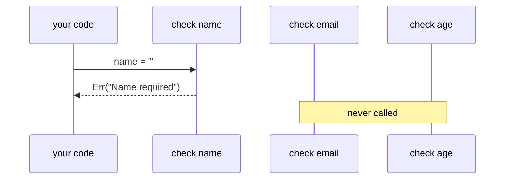
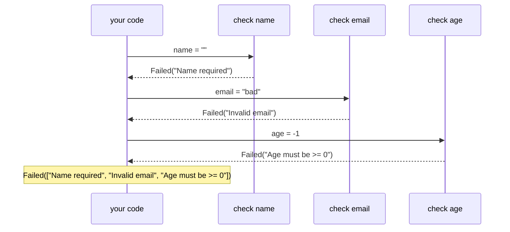

If you've ever fixed a validation error on a form, resubmitted, and been told about a *different*
error — you've felt the frustration of validation that stops at the first failure.
`Validation<E, A>` runs all checks and collects every failure in one pass. Users see everything
wrong at once, not one problem at a time.

## The problem with short-circuiting

When validating a form, `Result`'s behavior is unhelpful:

```ts
pipe(
  validateName(form.name),
  Result.chain(() => validateEmail(form.email)),
  Result.chain(() => validateAge(form.age)),
);
```

If `validateName` fails, the pipeline stops. The user sees one error, fixes it, submits again, and
sees the next one. You want to show all three errors at once.

## The Validation approach

`Validation` accumulates errors across independent checks. When you combine two failed validations,
both error lists are merged:

```ts
import { pipe } from "@nlozgachev/pipelined/composition";
import { Validation } from "@nlozgachev/pipelined/core";

const validateName = (name: string): Validation<string, string> =>
  name.length > 0
    ? Validation.passed(name)
    : Validation.failed("Name is required");

const validateAge = (age: number): Validation<string, number> =>
  age >= 0
    ? Validation.passed(age)
    : Validation.failed("Age must be non-negative");
```

Running both checks with `ap` collects all failures:

```ts
pipe(
  Validation.passed((name: string) => (age: number) => ({ name, age })),
  Validation.ap(validateName("")),
  Validation.ap(validateAge(-1)),
);
// Failed(["Name is required", "Age must be non-negative"])
```

If both pass, you get the assembled value:

```ts
pipe(
  Validation.passed((name: string) => (age: number) => ({ name, age })),
  Validation.ap(validateName("Alice")),
  Validation.ap(validateAge(30)),
);
// Passed({ name: "Alice", age: 30 })
```

## Creating Validations

```ts
Validation.passed(42); // Passed(42)
Validation.failed("too short"); // Failed(["too short"]) — single error
Validation.failedAll(["too short", "missing digits"]); // Failed([...]) — multiple errors
```

`failed` wraps a single error in a list. `failedAll` accepts a `NonEmptyList` directly, useful when
you already have a collection of errors.

`fromPredicate` builds a `Validation` from a condition check — useful when validating a single field
against a rule:

```ts
const validateLength = Validation.fromPredicate(
  (s: string) => s.length >= 8,
  (s) => `"${s}" must be at least 8 characters`,
);

validateLength("hi"); // Failed(['"hi" must be at least 8 characters'])
validateLength("longpassword"); // Passed("longpassword")
```

The second argument receives the original value, so error messages can include the bad input.
`fromPredicate` composes naturally with `ap` and `product` — create one validator per rule, then
combine them.

## How `ap` accumulates errors

`ap` is what sets `Validation` apart from `Result`. The pattern is: start with your constructor
function wrapped in `Validation.passed`, then apply each validated argument with `ap`:

```ts
// Constructor: (field1) => (field2) => (field3) => result
const build = (email: string) => (password: string) => (age: number) => ({
  email,
  password,
  age,
});

pipe(
  Validation.passed(build),
  Validation.ap(validateEmail(form.email)), // applies first arg
  Validation.ap(validatePassword(form.password)), // applies second arg
  Validation.ap(validateAge(form.age)), // applies third arg
);
```

Each `ap` step:

- If both sides are passed, applies the function to the value
- If either side is failed, merges both error lists into a single `Failed`

The key property: all `ap` steps run regardless of prior failures. This is what allows all errors to
be collected.

The `ap` pattern looks unusual at first. A simpler read: you're lifting a curried constructor and
applying each validated argument one by one. If the constructor shape feels awkward, `productAll`
often expresses the same intent more directly — pass a list of validations, get back a list of
passed values.

## Combining two validations with `product`

`product` takes two independent validations and combines them into a single `Validation` holding a
tuple of both values. If either fails, errors from both sides are merged:

```ts
Validation.product(
  Validation.passed("alice"),
  Validation.passed(30),
); // Passed(["alice", 30])

Validation.product(
  Validation.failed("Name required"),
  Validation.failed("Age must be >= 0"),
); // Failed(["Name required", "Age must be >= 0"])
```

This is the binary building block for combining two independent checks when you want both values
afterwards.

## Combining many validations with `productAll`

`productAll` takes a non-empty list of validations, runs all of them, and either collects all values
or accumulates all errors:

```ts
Validation.productAll([
  validateName(form.name),
  validateEmail(form.email),
  validateAge(form.age),
]);
// Passed([name, email, age]) — if all pass
// Failed([...all errors]) — if any fail
```

Because the input is a `NonEmptyList`, the empty-array case is a compile-time error — the return
type is always `Validation<E, readonly A[]>` with no `undefined`.

## Transforming values with `map`

`map` transforms the passed value, leaving `Failed` untouched:

```ts
pipe(
  Validation.passed(5),
  Validation.map((n) => n * 2),
); // Passed(10)
pipe(
  Validation.failed("oops"),
  Validation.map((n) => n * 2),
); // Failed(["oops"])
```

## Extracting the value

**`getOrElse`** — provide a fallback as a thunk `() => B`, called only when the result is `Failed`.
The fallback can be a different type, widening the result to the union of both:

```ts
pipe(Validation.passed(5), Validation.getOrElse(() => 0)); // 5
pipe(Validation.failed("oops"), Validation.getOrElse(() => 0)); // 0
pipe(Validation.failed("oops"), Validation.getOrElse(() => null)); // null — typed as number | null
```

**`match`** — handle each case explicitly. The failed handler receives the full error list. `fold`
is the positional form — failed handler first, passed handler second:

```ts
pipe(
  validation,
  Validation.match({
    passed: (value) => renderSuccess(value),
    failed: (errors) => renderErrors(errors), // errors: NonEmptyList<string>
  }),
);
```

## Recovering from Failed

`recover` provides a fallback `Validation` when the result is `Failed`. The fallback receives the
accumulated error list, so you can inspect which errors occurred and decide how to recover:

```ts
pipe(
  validateConfig(input),
  Validation.recover((errors) => {
    console.warn("Validation failed:", errors);
    return Validation.passed(defaultConfig);
  }),
);
```

When the input is already `Passed`, the fallback is never called:

```ts
pipe(
  Validation.passed(42),
  Validation.recover((_errors) => Validation.passed(0)),
); // Passed(42) — fallback skipped
```

## Observing errors without changing them

`tapError` runs a side effect on the error list when the result is `Failed`, then passes the
`Validation` through unchanged. Use it to log or report failures mid-pipeline:

```ts
pipe(
  Validation.productAll([validateName(form.name), validateEmail(form.email)]),
  Validation.tapError((errors) => logger.warn("Validation failed", { errors })),
  Validation.match({
    passed: (data) => save(data),
    failed: (errors) => renderErrors(errors),
  }),
);
```

`tapError` receives the full `NonEmptyList<E>` — all accumulated errors, not just the first. When
the result is `Passed`, `tapError` is a no-op and the value passes through.

## Extracting the value as Maybe

`toMaybe` extracts the validated value as `Some` and silently discards the errors as `None`. Use it
when the errors have already been collected or reported and all you need is the value to continue:

```ts
Validation.toMaybe(Validation.passed(42)); // Some(42)
Validation.toMaybe(Validation.failed("bad input")); // None
```

This pairs naturally with `Maybe.getOrElse` when a fallback value is acceptable if validation fails.

## Converting from Result

`fromResult` wraps a `Result` in a `Validation`. `Ok(a)` becomes `Passed(a)`; `Err(e)` becomes
`Failed([e])`. Use it when bridging code that short-circuits on the first error into a pipeline that
accumulates all errors:

```ts
Validation.fromResult(Result.ok(42)); // Passed(42)
Validation.fromResult(Result.err("bad")); // Failed(["bad"])
```

The single error is placed in a one-element list so the result is a valid `Validation<E, A>`
regardless of how many errors the downstream code expects.

## Converting to Result

When you've finished collecting errors and want to feed the result into a pipeline that uses
`Result`, `toResult` does the conversion in one step: `Passed` becomes `Ok`, `Failed` becomes `Err`
with the full error list:

```ts
pipe(
  Validation.productAll([validateName(form.name), validateEmail(form.email)]),
  Validation.toResult,
  Result.chain(saveUser),
  Result.getOrElse(() => null),
);
```

The `Err` carries `NonEmptyList<E>` — every error that was collected — so downstream error handling
has the full picture. This is the natural handoff point from `Validation` (run all checks) to
`Result` (sequence the side effects).

## How it compares to Result

**Result — stops at first error**



**Validation — all checks run**



## When to use Validation vs Result

Use `Validation` when:

- You're validating multiple independent fields and want all errors at once
- The consumer of your output (e.g., a form UI) needs the complete list of what went wrong

Use `Result` when:

- Each step depends on the previous one succeeding — convert to `Result` and use `Result.chain` for
  dependent validation, then convert back
- You want to fail fast and stop processing as soon as something goes wrong
- The operation isn't about validation — it's about control flow

In practice, many real-world scenarios mix both: use `Validation` to check individual fields, then
use `Result` to sequence the side effects once the data is known to be valid.
